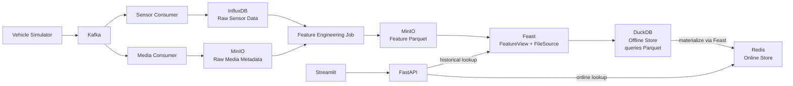
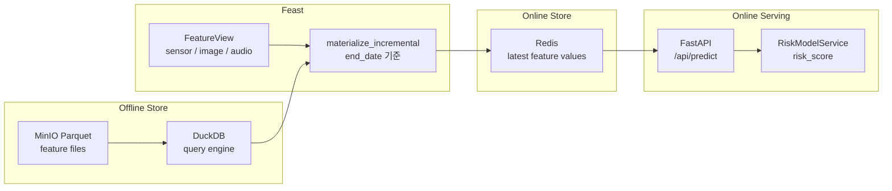
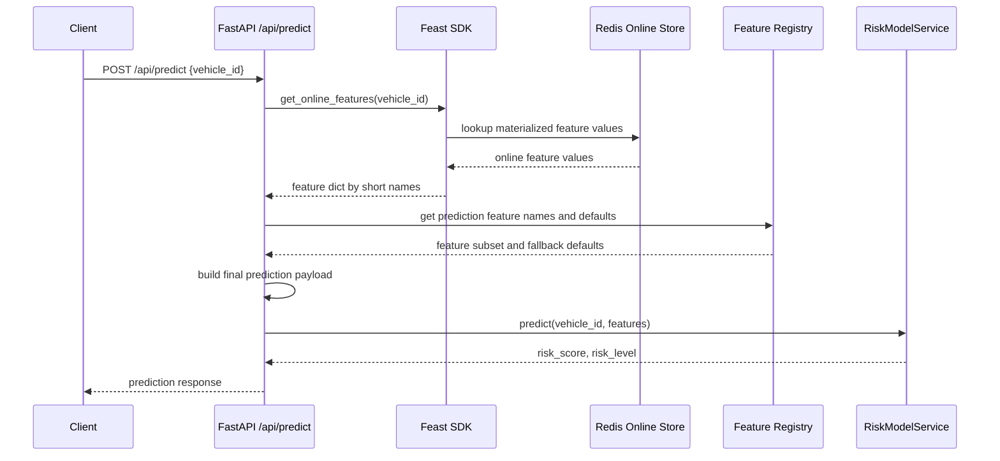

# Feature Store Demo: 자율주행 차량 위험도 예측 파이프라인 만들기

이 프로젝트는 자율주행 차량 이벤트를 예시로, Raw Data가 Feature Store를 거쳐 온라인 예측에 사용되는 흐름을 보여주는 데모입니다.

MLOps Platform을 개발하면서 기존 데이터 파이프라인 위에서 feature를 어떤 방식으로 더 일관되게 관리할 수 있을지 PoC 관점에서 확인해 보려 합니다. 실제 서비스에서는 모델이 사용하는 feature를 누가 정의하고, 어디에 저장하며, 학습과 서빙에서 어떻게 같은 기준으로 재사용할지에 대한 부분들이 블랙박스이므로 이번 데모를 통해 배워보려 합니다.

목표는 단순합니다.

```
차량 센서 / 이미지 / 오디오 이벤트 수집
→ Raw Data 저장
→ Feature Engineering
→ Offline Feature Store 저장
→ Training Dataset 생성
→ Online Store materialization
→ FastAPI에서 online feature 조회
→ Streamlit에서 위험도 예측 결과 확인
```

이 데모의 초점은 모델 성능이 아니라, feature를 어떻게 정의하고, 저장하고, 학습/서빙 양쪽에서 재사용하는지에 두었기 때문에 예측 모델 자체는 복잡한 ML 모델이 아니라 rule-based risk scoring으로 구성했습니다.

---

# 왜 Feature Store가 필요한가

머신러닝 시스템에서 feature는 모델 입력으로 사용되는 값입니다. 예를 들어 차량 위험도 예측에서는 다음 값들이 feature가 될 수 있습니다.

- 최근 10초 평균 속도
- 최근 10초 최소 장애물 거리
- 센서 결측률
- 감지된 보행자 수
- 사이렌 감지 여부

문제는 학습과 서빙에서 같은 feature를 같은 방식으로 만들어야 한다는 점입니다.

학습 데이터셋을 만들 때는 각 label이 발생한 시점에 실제로 알 수 있었던 과거 feature를 사용해야 합니다. 반면 온라인 추론에서는 지금 들어온 요청에 대해 online store에 적재된 최신 feature를 조회합니다.

예를 들어 학습 데이터의 기준 시점이 `10:00:00`이라면, `10:05:00`에 계산된 평균 속도나 보행자 수를 학습에 사용하면 안 됩니다. 미래 정보를 학습에 섞는 data leakage가 되고, 실제 운영 환경에서는 같은 값을 사용할 수 없기 때문입니다.

또한 학습 파이프라인과 서빙 파이프라인이 feature를 각각 다르게 계산하면 같은 `avg_speed_10s`라는 이름을 쓰더라도 실제 의미가 달라질 수 있습니다. timestamp 기준, 집계 window, null 처리, schema가 어긋나면 모델이 학습 때 본 입력과 운영에서 받는 입력이 달라지고, 이것이 training-serving skew로 이어질 수 있습니다.

Feature Store는 이 문제를 줄이기 위해 다음 역할을 합니다.

| 역할 | 설명 |
| --- | --- |
| Feature 정의 중앙화 | Entity, FeatureView, source, schema를 한곳에서 관리 |
| Offline Feature 조회 | 과거 시점 기준으로 training dataset 생성 |
| Online Feature Serving | Redis 같은 online store에서 low-latency 조회 |
| Materialization | Offline feature를 online store로 주기적으로 적재 |
| 재사용성 | 학습, 배치 추론, 온라인 추론이 같은 feature 정의를 사용 |

---

# 데모 시나리오

이 데모는 `vehicle_id` 기준으로 현재 주행 위험도 `risk_score`를 예측합니다.

위험도는 다음 feature들을 기반으로 계산합니다.

```
risk_score =
  obstacle_distance_min이 낮을수록 증가
  avg_speed_10s가 높을수록 증가
  sensor_missing_rate가 높을수록 증가
  pedestrian_count가 많을수록 증가
  siren_detected가 true면 증가
```

실제 구현에서는 `backend/app/services/risk_model.py`의 `RiskModelService`를 통해 rule-based score를 계산합니다.

---

# 전체 아키텍처

전체 흐름은 크게 세 단계로 나눌 수 있습니다. 먼저 차량에서 발생한 센서, 이미지, 오디오 이벤트를 raw data로 저장합니다. 그다음 feature engineering job이 raw data를 모델 입력에 맞는 feature table로 변환하고, Feast가 이 feature를 offline store와 online store에서 사용할 수 있도록 관리합니다. 마지막으로 FastAPI와 Streamlit은 online store에 적재된 최신 feature를 조회해 위험도 예측 결과를 보여줍니다.



구성 요소는 다음과 같습니다.

| 컴포넌트 | 기술 | 역할 |
| --- | --- | --- |
| Streaming | Kafka | 차량 이벤트 전달 |
| Raw Sensor Store | InfluxDB | 센서 time-series 저장 |
| Raw Object Store | MinIO | 이미지/오디오 메타데이터 저장 |
| Feature Store | Feast | FeatureView, offline/online serving 관리 |
| Offline Store | DuckDB + Parquet on MinIO | historical feature 조회 |
| Online Store | Redis | 실시간 feature serving |
| Backend | FastAPI | feature build, materialize, predict API |
| Frontend | Streamlit | 데모 UI |

여기서 중요한 점은 raw data 저장소와 feature store의 역할을 분리했다는 것입니다. InfluxDB와 MinIO는 원본 이벤트를 보관하고, Feature Engineering Job 이후의 Parquet 파일은 모델이 재사용할 feature 산출물로 관리합니다. Feast는 이 Parquet 파일을 `FileSource`로 등록하고, DuckDB offline store는 Parquet을 별도 테이블로 적재하는 것이 아니라 historical feature lookup에 필요한 query engine 역할을 합니다. 이후 Feast가 offline feature를 Redis online store로 materialize해서 실시간 예측 경로에서도 같은 feature를 조회할 수 있게 합니다.

---

# Raw Data와 Feature는 다르다

Feature Store는 raw data 저장소를 대체하지 않습니다.

이 프로젝트에서는 raw data와 feature를 분리했습니다.

| 구분 | 저장소 | 예시 |
| --- | --- | --- |
| Raw Sensor Data | InfluxDB | speed, acceleration, obstacle_distance, lidar_points |
| Raw Media Metadata | MinIO | image/audio metadata JSON |
| Feature Data | MinIO Parquet + Feast | avg_speed_10s, pedestrian_count, siren_detected |

Raw data는 차량에서 발생한 ㅈ사실을 가능한 한 원본에 가깝게 남긴 기록입니다. 반면 feature는 모델이 바로 사용할 수 있도록 raw data에 계산 기준과 의미를 부여한 값입니다.

예를 들어 센서 이벤트 stream에는 이런 row가 계속 들어올 수 있습니다.

| vehicle_id | timestamp | speed | acceleration | obstacle_distance |
| --- | --- | --- | --- | --- |
| V001 | 10:00:01 | 42.1 | 0.3 | 18.5 |
| V001 | 10:00:02 | 43.0 | 0.5 | 16.2 |
| V001 | 10:00:03 | 41.7 | -0.1 | 14.8 |

이 값들은 원본 기록으로는 중요하지만, 그대로 모델 입력으로 쓰기에는 어렵습니다. 모델은 매 초 들어온 개별 이벤트보다 “현재 위험도를 판단하는 데 필요한 요약값”을 필요로 하기 때문입니다.

그래서 feature engineering 단계에서는 같은 raw data를 다음과 같은 feature row로 바꿉니다.

| vehicle_id | event_timestamp | avg_speed_10s | acceleration_std_10s | obstacle_distance_min |
| --- | --- | --- | --- | --- |
| V001 | 10:00:10 | 42.4 | 0.27 | 14.8 |

여기서 `avg_speed_10s`는 단순히 속도 값 하나가 아닙니다. `vehicle_id = V001`에 대해 `10:00:10` 시점 이전 10초 동안의 평균 속도라는 계산 기준이 포함된 값입니다.

이 차이가 중요합니다. 같은 `speed` raw data라도 모델 목적에 따라 `avg_speed_10s`, `max_speed_1m`, `hard_brake_count_5m`처럼 여러 feature로 바뀔 수 있습니다. Raw data는 재처리 가능한 원본이고, feature는 특정 모델과 예측 목적에 맞게 가공된 입력값입니다.

따라서 Feature Store에는 raw event를 그대로 넣기보다, entity, timestamp, feature 이름, 타입, null 처리 기준이 정리된 feature data를 넣습니다. 그래야 학습 데이터셋을 만들 때도, 온라인 예측을 할 때도 같은 의미의 feature를 재사용할 수 있습니다.

---

# 왜 DuckDB + Parquet을 Offline Store로 선택했나

이 데모에서는 Feast offline store로 DuckDB를 사용하고, feature 산출물은 MinIO에 Parquet 파일로 저장합니다.

Feature engineering 결과는 보통 다음과 같은 파일 형태로 만들어집니다.

```
s3://mlops-features/sensor_features/<vehicle_id>/<YYYY-MM-DD>.parquet
s3://mlops-features/image_features/<vehicle_id>/<YYYY-MM-DD>.parquet
s3://mlops-features/audio_features/<vehicle_id>/<YYYY-MM-DD>.parquet
```

처음에는 이 데이터를 PostgreSQL에 저장하는 방식도 생각했습니다. Backend 관점에서는 익숙한 선택입니다. 테이블을 만들고, row를 insert하고, 필요한 API에서 조회하면 됩니다.

Feature 저장 방식은 정해져 있는 것이 아닙니다. PostgreSQL 테이블에 저장할 수도 있고, warehouse에 적재할 수도 있고, Parquet 같은 파일로 저장할 수도 있습니다.

다만 이 프로젝트에서는 feature engineering 결과를 MinIO의 Parquet 파일로 남기기로 했습니다.

```
sensor_features.parquet
image_features.parquet
audio_features.parquet
```

이 상황에서 PostgreSQL을 쓰려면 Parquet을 다시 읽어서 table schema에 맞춰 적재하는 단계가 하나 더 필요합니다.

```
Parquet 생성
→ PostgreSQL table schema 정의
→ COPY 또는 insert
→ index 관리
→ timestamp/entity join 성능 고려
→ schema 변경 시 migration 관리
```

여기서부터는 단순히 저장소를 하나 고르는 문제가 아니라, PostgreSQL 테이블을 계속 관리하는 문제가 됩니다. feature가 하나 추가되거나 타입이 바뀌면 migration을 신경 써야 하고, 과거 시점의 feature를 조회하려면 `vehicle_id`, `event_timestamp` 기준 index도 고민해야 합니다.

PostgreSQL이 나쁜 선택이라는 뜻은 아닙니다. 오히려 feature catalog, 실행 이력, 권한, 설정값 같은 메타데이터를 관리하는 데는 PostgreSQL이 잘 맞는다고 생각합니다.

이번 구조에서는 Feast가 FileSource로 Parquet을 바로 읽을 수 있습니다. 그래서 굳이 PostgreSQL에 한 번 더 적재하기보다 DuckDB + Parquet 조합을 사용하는 편이 더 단순했습니다.

반면 DuckDB + Feast FileSource 조합은 훨씬 단순합니다.

```
Parquet 생성
→ Feast FileSource path 지정
→ FeatureView 등록
→ get_historical_features / materialize
```

DuckDB는 embedded database에 가깝기 때문에 별도 DB 서버를 운영하지 않아도 됩니다. 또한 MinIO 같은 S3 compatible object storage에 있는 Parquet 파일을 읽는 구조와 잘 맞습니다.

정리하면 PostgreSQL은 메타데이터 관리에는 좋은 선택이 될 수 있지만, 이 프로젝트에서 feature 값을 저장하고 과거 feature를 조회하는 용도로는 DuckDB + Parquet이 더 자연스러웠습니다.

## 여기서 DuckDB는 무슨 역할을 하나

이 구조에서 실제 feature 파일은 MinIO에 Parquet 형태로 저장됩니다. DuckDB는 그 파일을 저장하는 역할이 아니라, 저장된 Parquet 파일을 읽어서 historical feature 조회에 필요한 query를 실행하는 역할을 합니다.

예를 들어 training dataset을 만들 때는 특정 `vehicle_id`와 `event_timestamp` 기준으로 과거 feature 값을 찾아야 합니다. Feast는 “어떤 FeatureView에서 어떤 feature를 가져와야 하는지”를 알고 있고, DuckDB는 그 요청을 처리하기 위해 Parquet 파일을 읽어 filter, join, aggregation 같은 query를 수행합니다.

역할을 단순화하면 다음과 같습니다.

| 구성 요소 | 역할 |
| --- | --- |
| MinIO | feature Parquet 파일을 저장하는 object storage |
| DuckDB | MinIO의 Parquet 파일을 읽고 filter/join/query를 수행하는 embedded query engine |
| Feast | feature 정의, entity, timestamp 기준 조회 흐름을 관리하는 feature store layer |

즉, DuckDB를 쓴다고 해서 별도의 DuckDB 서버나 컨테이너가 뜨는 것은 아닙니다. Backend나 Feast CLI가 실행되는 Python process 안에서 DuckDB library가 동작합니다.

이 구조 덕분에 feature engineering 결과를 Parquet으로 저장한 뒤, PostgreSQL 같은 DB에 다시 적재하지 않고도 offline feature 조회와 materialization에 사용할 수 있습니다.

---

# Feast는 서버라기보다 Feature Store 레이어다

처음 Feast를 접하면 “Feast 컨테이너가 떠 있어야 하나?”라고 생각하기 쉽습니다. 이 프로젝트에서는 Feast를 별도 서비스 컨테이너로 띄우지 않습니다.

Feast는 Python SDK와 CLI로 동작합니다.

| 실행 방식 | 설명 |
| --- | --- |
| CLI | `feast apply`, `feast materialize-incremental` 실행 |
| SDK | FastAPI 내부에서 `FeatureStore` 객체를 통해 feature 조회 |

현재 구조에서는 FastAPI backend가 Feast SDK를 사용해 Redis online store와 DuckDB offline store에 접근합니다.

```python
from feast import FeatureStore

store = FeatureStore(repo_path="./feast_repo")
store.get_online_features(...)
```

즉, Docker Compose로 떠 있는 주요 데이터 서비스는 Kafka, MinIO, InfluxDB, Redis이고, Feast는 이 저장소들을 feature serving 관점에서 연결하는 관리/서빙 레이어에 가깝습니다.

---

# Feast 설정

현재 `feast_repo/feature_store.yaml`은 다음 구조를 사용합니다.

```yaml
project: vehicle_risk_demo
provider: local
registry: data/registry.db
metadata_store:
  type: sqlite
  path: data/metadata.db

offline_store:
  type: duckdb

online_store:
  type: redis
  connection_string: redis:6379,password=redis123

entity_key_serialization_version: 2
```

SQLite 기반 registry/metadata store를 사용한 이유는 다음과 같습니다.
- feature definition을 Feast registry에 등록한다
- offline store의 feature를 historical lookup으로 조회한다
- offline feature를 online store로 materialize한다
- prediction API에서 같은 FeatureView를 기준으로 online feature를 조회한다
별도 DB나 registry 서비스를 운영하지 않아도 Docker Compose 환경에서 Feast 설정, feature apply, materialization, online serving 흐름을 확인할 수 있기 때문입니다.

운영 환경에서 여러 서비스가 같은 registry를 공유해야 한다면, registry backend를 object storage나 별도 공유 저장소로 분리하는 방식을 검토할 수 있습니다. 이 글에서는 데모 프로젝트의 구조를 설명하는 것이 목적이므로 SQLite 기반 로컬 registry를 사용합니다.

---

# Feature 설계

Feature Store를 처음 설계할 때 가장 먼저 정해야 하는 것은 “무엇을 기준으로 feature를 조회할 것인가?”입니다.

이 데모에서는 차량별 현재 위험도를 예측하므로 조회 기준은 자연스럽게 `vehicle_id`가 됩니다. 사용자가 `V001` 차량의 위험도를 요청하면, Feature Store는 `vehicle_id = V001`에 해당하는 최신 센서, 이미지, 오디오 feature를 가져와야 합니다.

## Entity

> Entity는 “무엇에 대한 데이터인가?”를 식별하는 대상입니다. 예를 들어 차량, 운전자, 주행 세션처럼 feature를 조회할 기준이 되는 값을 의미합니다.

Feature Store에서 Entity는 feature를 조회할 때 사용하는 `join key` 역할을 합니다.

이 데모에서는 차량 단위로 위험도를 예측하므로 `vehicle_id` 하나를 Entity 기준으로 사용했습니다.

```python
from feast import Entity

vehicle = Entity(
    name="vehicle",
    join_keys=["vehicle_id"],
)
```

나중에 더 복잡한 시나리오로 확장하면 조회 기준을 다음처럼 세분화할 수 있습니다.

- `drive_session_id`
- `sensor_id`
- `camera_id`

## Feature

Feature는 모델이 입력으로 사용하는 하나의 수치, 상태, 신호입니다.

이 프로젝트에서는 다음 값들이 feature가 됩니다.

- 최근 10초 평균 속도
- 최근 10초 최소 장애물 거리
- 감지 객체 수
- 보행자 수
- 소음 레벨
- 사이렌 감지 여부

하나의 feature는 보통 특정 시점의 상태를 나타냅니다. 그래서 feature에는 값뿐만 아니라 “언제의 값인가”를 나타내는 timestamp도 중요합니다.

예를 들어 `avg_speed_10s = 52.3`이라는 값만 있으면 부족합니다. 이 값이 어떤 차량의 값인지, 어느 시점의 값인지 함께 알아야 학습이나 추론에 사용할 수 있습니다.

센서 feature를 코드로 표현하면 다음과 같습니다.

```python
from feast import Field
from feast.types import Float32, Int64

sensor_feature_fields = [
    Field(name="avg_speed_10s", dtype=Float32),
    Field(name="accel_std_10s", dtype=Float32),
    Field(name="obstacle_distance_min", dtype=Float32),
    Field(name="lidar_point_count", dtype=Int64),
    Field(name="sensor_missing_rate", dtype=Float32),
]
```

## FeatureView

FeatureView는 같은 Entity와 같은 맥락에서 함께 쓰이는 feature들의 묶음입니다.

단순히 “테이블 이름”이라기보다는, feature를 어떻게 조회하고 관리할지 정의한 단위에 가깝습니다.

FeatureView에는 보통 다음 정보가 들어갑니다.

- 어떤 feature들을 포함할지
- 어떤 Entity 기준으로 조회할지
- 어떤 Source에서 읽을지
- feature가 얼마 동안 유효한지
- online store에 materialize할지

예를 들어 `sensor_features` FeatureView는 `vehicle_id` 기준으로 센서 기반 feature들을 묶은 정의입니다.

```python
from datetime import timedelta
from feast import FeatureView

sensor_features = FeatureView(
    name="sensor_features",
    entities=[vehicle],
    ttl=timedelta(hours=168),
    schema=sensor_feature_fields,
    source=sensor_features_source,
    online=True,
)
```

정리하면 다음처럼 볼 수 있습니다.

| 개념 | 질문 | 이 프로젝트 예시 |
| --- | --- | --- |
| Entity | 무엇에 대한 feature인가? | `vehicle_id` |
| Feature | 모델에 넣을 값은 무엇인가? | `avg_speed_10s`, `pedestrian_count` |
| FeatureView | 이 feature들을 어떤 기준과 source로 관리할 것인가? | `sensor_features` |
| Source | feature가 어디에 저장되어 있는가? | MinIO Parquet |

이 프로젝트에서는 원천 데이터의 성격이 다르기 때문에 FeatureView를 세 개로 나눴습니다.

| FeatureView | 원천 데이터 | 설명 |
| --- | --- | --- |
| `sensor_features` | InfluxDB | 센서 time-series를 10초 단위로 집계 |
| `image_features` | MinIO metadata | 이미지 분석 결과를 demo feature로 사용 |
| `audio_features` | MinIO metadata | 오디오 분석 결과를 demo feature로 사용 |

실제 feature 정의는 `backend/app/services/feature_registry.py`에 중앙화되어 있고, `feast_repo/feature_views.py`는 이 registry를 읽어 Feast FeatureView를 생성합니다.

---

# Sensor Features

`sensor_features`는 차량의 주행 상태를 숫자로 요약한 FeatureView입니다.

원천 데이터는 InfluxDB에 저장된 sensor time-series입니다. 이벤트 단위의 raw sensor data를 그대로 모델에 넣기보다는, 10초 단위로 묶어 평균 속도, 가속도 변화, 최소 장애물 거리 같은 값으로 집계합니다.

| 항목 | 내용 |
| --- | --- |
| 원천 데이터 | InfluxDB sensor time-series |
| 만드는 방식 | 10초 window aggregation |
| 저장 위치 | `s3://mlops-features/sensor_features/...` |
| 사용 목적 | 주행 상태와 위험 신호를 모델 입력으로 제공 |

| Feature | 의미 |
| --- | --- |
| `avg_speed_10s` | 최근 10초 평균 속도 |
| `accel_std_10s` | 최근 10초 가속도 표준편차 |
| `obstacle_distance_min` | 최근 10초 최소 장애물 거리 |
| `lidar_point_count` | LIDAR 포인트 수 |
| `sensor_missing_rate` | 센서 누락률 |

이 FeatureView는 실제 raw sensor data에서 계산되므로, 세 FeatureView 중 가장 feature engineering에 가까운 예시입니다.

Feast FileSource는 MinIO의 Parquet 파일을 바라봅니다.

```python
FileSource(
    name="sensor_features_source",
    path="s3://mlops-features/sensor_features/*/*.parquet",
    timestamp_field="event_timestamp",
    file_format=ParquetFormat(),
)
```

실제 source path는 `FEAST_DATA_PATH` 환경변수를 기반으로 만들어지며, 기본값은 `s3://mlops-features`입니다.

---

# Image Features

`image_features`는 차량 주변 상황을 이미지 분석 결과로 표현하는 FeatureView입니다.

운영 환경이라면 raw image를 읽고 CV 모델을 실행해 객체 수, 보행자 수, 차선 인식 신뢰도 같은 값을 추출해야 합니다. 다만 이 데모에서는 실제 이미지 모델을 실행하지 않고, simulator/media metadata에서 이미 만들어진 값을 demo feature로 사용합니다.

| 항목 | 내용 |
| --- | --- |
| 원천 데이터 | MinIO image metadata |
| 만드는 방식 | 데모에서는 metadata 기반 feature 생성 |
| 실제 운영 시 | raw image decode + CV model inference 필요 |
| 저장 위치 | `s3://mlops-features/image_features/...` |

| Feature | 의미 |
| --- | --- |
| `object_count` | 감지 객체 수 |
| `pedestrian_count` | 감지 보행자 수 |
| `lane_detect_score` | 차선 인식 신뢰도 |

즉, 이 FeatureView는 “이미지 기반 feature가 Feature Store에 들어온다면 어떤 형태가 되는가”를 보여주기 위한 단순화된 예시입니다.

---

# Audio Features

`audio_features`는 차량 주변의 소리 정보를 위험 신호로 변환한 FeatureView입니다.

운영 환경이라면 raw audio를 읽고 waveform 전처리나 audio event detection 모델을 통해 소음 레벨, 사이렌 감지 여부를 계산해야 합니다. 이 데모에서는 실제 audio processing은 생략하고, media metadata에 포함된 값을 demo feature로 사용합니다.

| 항목 | 내용 |
| --- | --- |
| 원천 데이터 | MinIO audio metadata |
| 만드는 방식 | 데모에서는 metadata 기반 feature 생성 |
| 실제 운영 시 | raw audio decode + signal processing/model inference 필요 |
| 저장 위치 | `s3://mlops-features/audio_features/...` |

| Feature | 의미 |
| --- | --- |
| `noise_level` | 주변 소음 레벨 |
| `siren_detected` | 사이렌 감지 여부 |

이 FeatureView는 카메라뿐 아니라 오디오 같은 다른 modality도 같은 Feature Store 구조 안에서 다룰 수 있음을 보여줍니다.

---

# Feature Engineering: Raw Data에서 Parquet으로

FeatureView는 feature의 정의입니다. 하지만 FeatureView를 정의했다고 feature 값이 자동으로 생기는 것은 아닙니다.

실제 feature 값은 raw data를 읽고 계산해서 만들어야 합니다. 이 과정을 feature engineering이라고 볼 수 있습니다.

이 프로젝트에서 feature engineering job은 다음 일을 합니다.

1. InfluxDB에서 sensor raw data를 읽는다.
2. MinIO에서 image/audio metadata를 읽는다.
3. raw data를 FeatureView schema에 맞는 row로 변환한다.
4. `vehicle_id`, `event_timestamp`를 붙인다.
5. FeatureView별로 Parquet 파일을 만든다.
6. MinIO의 `mlops-features` 버킷에 업로드한다.

여기서 중요한 컬럼은 `vehicle_id`와 `event_timestamp`입니다.

`vehicle_id`는 어떤 차량의 feature인지 나타내는 Entity key, `event_timestamp`는 이 feature가 어느 시점의 상태인지를 나타냅니다.

Feature Store에서는 단순히 최신 값만 중요한 게 아니고, 학습 데이터셋을 만들 때는 “이 시점에 알 수 있었던 feature 값”(historical feature lookup)을 찾아야 하기 때문에 timestamp가 꼭 필요합니다.

FeatureView별 처리 방식은 다음과 같습니다.

| FeatureView | Raw input | 처리 방식 | Output |
| --- | --- | --- | --- |
| `sensor_features` | InfluxDB sensor time-series | 10초 window aggregation | sensor feature parquet |
| `image_features` | MinIO image metadata | demo metadata를 feature row로 변환 | image feature parquet |
| `audio_features` | MinIO audio metadata | demo metadata를 feature row로 변환 | audio feature parquet |

저장 경로는 FeatureView 이름과 `vehicle_id`, 날짜 기준으로 나눴습니다.

```
s3://mlops-features/
├── sensor_features/<vehicle_id>/<YYYY-MM-DD>.parquet
├── image_features/<vehicle_id>/<YYYY-MM-DD>.parquet
└── audio_features/<vehicle_id>/<YYYY-MM-DD>.parquet
```

이렇게 저장하면 FeatureView별로 source path를 나누기 쉽고, 특정 차량이나 날짜 기준으로 데이터를 확인하기도 쉽습니다.

이 데모에서는 이해를 쉽게 하기 위해 FastAPI endpoint와 Python job script로 feature build를 실행할 수 있게 만들었습니다.

```bash
curl -X POST http://localhost:8000/api/features/build
```

실무에서는 Feature engineering은 데이터 양이 많고, 주기적으로 반복되며, 실패 시 재시도나 backfill이 필요한 작업이기 때문에 보통은 백그라운드 Job 실행을 합니다.

보통 실무에서는 다음과 같은 방식으로 처리합니다.

| 방식 | 예시 | 설명 |
| --- | --- | --- |
| Batch workflow | Airflow, Dagster, Prefect | 정해진 주기로 raw data를 읽고 feature table 생성 |
| Spark/SQL job | Spark, dbt, warehouse SQL | 대용량 data lake/warehouse에서 feature 생성 |
| Streaming pipeline | Kafka Streams, Flink, Spark Streaming | 이벤트를 실시간으로 처리해 feature 갱신 |
| Backend-triggered job | FastAPI → queue/worker | 내부 도구나 수동 실행용으로 job 등록 |

---

# Offline Store: 학습 데이터셋 생성

Feature Store를 쓰기 전에는 학습 데이터셋을 만드는 코드와 온라인 서빙 코드가 따로 존재하는 경우가 많습니다.

예를 들어 학습 데이터셋은 batch SQL로 만들고, 온라인 추론에서는 backend service가 Redis나 DB에서 값을 직접 조합한다고 가정해볼 수 있습니다.

```text
학습 데이터셋 생성 코드
- avg_speed_10s = 최근 10초 평균 속도
- obstacle_distance_min = 최근 10초 최소 장애물 거리

온라인 서빙 코드
- avg_speed_10s = 최근 30초 평균 속도
- obstacle_distance_min = 현재 이벤트의 장애물 거리
```

위 예시에서 학습 데이터셋과 온라인 서빙에서 서로 다른 feature를 사용하고 있습니다. 모델은 학습 시의 feature 분포를 기준으로 학습되지만, 실제 서빙에서는 다른 방식으로 생성된 feature가 입력되면 성능 저하나 예측 오류가 발생할 수 있습니다. 이러한 학습-서빙 간 feature 불일치를 training-serving skew라고 합니다.

Feature Store를 사용하면 학습 데이터셋 생성과 online serving이 같은 FeatureView를 사용하기 때문에 이러한 문제를 해결할 수 있습니다.

```text
FeatureView 정의
      ├── historical feature lookup → training dataset
      └── materialization → online store → serving
```

여기서 offline store는 과거 시점의 feature를 조회하는 역할을 합니다. 학습 데이터셋을 만들 때는 단순히 최신 값을 가져오는 것이 아니라, 각 학습 row의 기준 시점에 실제로 알 수 있었던 feature 값을 가져와야 합니다.
예를 들어 10시의 위험도를 예측하는 학습 row를 만든다고 해보겠습니다. 이때 10시 이후에 생성된 feature가 포함되면 모델이 미래 정보를 보고 학습하게 되어 data leakage가 발생합니다.
Feast의 historical feature lookup은 entity와 timestamp를 기준으로 해당 시점에 유효했던 point-in-time feature를 조회하는 기능입니다.
이때 point-in-time 조회란 각 row의 timestamp를 기준으로, 그 시점까지 실제로 알 수 있었던 최신 feature 값을 가져오는 방식을 의미합니다. 즉, 미래에 생성되거나 갱신된 feature는 제외하고, 해당 시점에서 사용 가능했던 값만 학습 데이터에 포함합니다.

현재 데모에서는 아래 API로 training dataset을 생성합니다.

```bash
curl -X POST http://localhost:8000/api/features/training-dataset \
  -H "Content-Type: application/json" \
  -d '{
    "output_path":"./data/training_dataset.parquet",
    "hours":168,
    "interval_minutes":60,
    "vehicle_ids":["V001","V002","V003"]
  }'
```

이 데모에서는 편의를 위해 rule-based `risk_score`, `risk_level`을 synthetic label로 붙였습니다. 실제 프로젝트에서는 label이
  Feature Store에서 자동으로 생기는 것이 아니라, 사고 로그나 사용자 행동 로그, 운영 DB, 사람이 라벨링한 데이터 등 별도의
  source에서 옵니다.

이 데모에서는 label도 rule-based로 만들었지만, 실제 프로젝트에서는 이 dataset을 모델 학습 파이프라인의 입력으로 사용할 수 있습니다.

중요한 점은 학습 dataset을 만들 때 사용한 feature 정의와 online serving에서 조회하는 feature 정의가 같은 FeatureView라는 것입니다. 이렇게 하면 학습과 서빙에서 서로 다른 feature 정의를 사용하는 문제를 줄일 수 있습니다.

---

# Materialization: Offline에서 Online으로

Online serving에서는 매 요청마다 MinIO의 Parquet 파일을 읽고 DuckDB로 조회하지 않습니다. 그렇게 하면 object storage 접근, Parquet scan, point-in-time lookup같은 과정 때문에 API latency를 예측하기 어렵기 때문에 실시간 서빙을 하기가 어렵습니다.

대신 serving에 필요한 최신 feature 값을 Redis online store에 미리 적재해두고, FastAPI는 Redis에서 low-latency로 feature를 조회합니다. 이 적재 과정을 materialization이라고 부릅니다.



이때 Redis에 들어가는 것은 raw data가 아니라 FeatureView에 정의된 feature value입니다.

| FeatureView | Online store에 적재되는 예 |
| --- | --- |
| `sensor_features` | `avg_speed_10s`, `obstacle_distance_min`, `sensor_missing_rate` |
| `image_features` | `pedestrian_count` |
| `audio_features` | `siren_detected` |

이 프로젝트에서는 데모 편의를 위해 API로 materialization을 실행할 수 있게 만들었습니다.

```bash
curl -X POST http://localhost:8000/api/features/materialize
```

`end_date`를 지정하면 해당 시각까지 materialize합니다.

```bash
curl -X POST http://localhost:8000/api/features/materialize \
  -H "Content-Type: application/json" \
  -d '{"end_date":"2026-05-24T12:00:00Z"}'
```

또는 Feast CLI로 직접 실행할 수 있습니다.

```bash
cd feast_repo
feast materialize-incremental --end-date 2026-05-24T12:00:00Z
```

내부적으로는 FastAPI가 `FeatureStore.materialize_incremental(end_date)`를 호출합니다. `end_date`를 넘기지 않으면 현재 UTC 시각까지 materialize합니다.

즉, 현재 데모의 materialization API는 `feast materialize-incremental`을 FastAPI endpoint로 감싼 형태에 가깝습니다. 

실무에서는 보통 materialization을 사용자 요청 API에 직접 묶기보다는 별도의 batch job이나 workflow로 구성합니다. 예를 들어 feature engineering job이 offline store에 최신 feature를 저장한 뒤, Airflow, Dagster, Argo Workflows, Kubernetes CronJob 같은 스케줄러가 정해진 주기나 이벤트에 맞춰 `feast materialize-incremental`을 실행합니다.

이때 함께 관리하는 것은 단순 실행 여부만이 아닙니다. 어느 시점까지 materialize했는지, 실패 한 경우 재시도할 수 있는지, 특정 기간을 backfill해야 하는지도 함께 관리합니다. 또한 각 FeatureView의 값이 너무 오래된 상태로 online store에 남아 있지 않은지도 확인합니다. 예를 들 어 5분마다 갱신되어야 하는 feature가 30분 전 값으로 서빙되고 있다면, 예측 품질에 영향을 줄 수 있기 때문입니다. 그래서 운영 환경에서는 materialization을 하나의 serving 준비 단계로 보 고, feature 생성, validation, materialization, freshness monitoring을 하나의 파이프라인으로 묶는 경우가 많습니다.

여기서 중요한 점은 offline store와 online store의 역할이 다르다는 것입니다. Offline store는 학습 데이터셋을 만들 때 과거 여러 시점의 feature를 point-in-time 기준으로 조회하는 데 사용 됩니다. 반면 online store는 실시간 예측에 사용할 최신 feature 값을 미리 적재해두고 빠르게 조회하기 위한 저장소입니다. Materialization은 offline store에 있는 feature 값을 online store로 옮겨, serving 경로에서 낮은 latency로 조회할 수 있게 만드는 과정입니다.

```text
Historical lookup
→ 여러 과거 시점의 feature 조회
→ training dataset 생성

Materialization
→ 최신 feature value를 Redis에 적재
→ online prediction에서 조회
```

Materialization이 끝나면 다음 API로 Redis online store에 feature가 들어왔는지 확인할 수 있습니다.

```bash
curl "http://localhost:8000/api/features/online?vehicle_id=V001"
```

또는 feature freshness와 마지막 materialization 시각을 확인할 수 있습니다.

```bash
curl "http://localhost:8000/api/features/status?vehicle_id=V001"
```

---

# Serving: Online Feature 조회와 위험도 예측

여기서 중요한 점은 serving 경로에서는 offline historical lookup을 하지 않는다는 것입니다. 학습 데이터셋을 만들 때는 여러 과거 시점의 feature가 필요하지만, online prediction에서는 현재 요청에 사용할 최신 feature만 필요합니다.

| 구분 | 사용하는 Feast API | 목적 |
| --- | --- | --- |
| Training dataset | `get_historical_features` | 과거 시점 기준으로 학습 row 생성 |
| Online serving | `get_online_features` | 현재 예측 요청에 사용할 최신 feature 조회 |

예측 API는 `backend/app/api/predict.py`에 구현되어 있습니다.

요청 예시는 다음과 같습니다.

```bash
curl -X POST http://localhost:8000/api/predict \
  -H "Content-Type: application/json" \
  -d '{"vehicle_id":"V001"}'
```

요청이 들어오면 FastAPI는 `vehicle_id`를 기준으로 Feast SDK를 호출합니다.

```python
online_features = feast_service.get_online_features(vehicle_id=request.vehicle_id)
```

내부적으로 Feast는 `vehicle_id = V001`에 대해 Redis online store에 materialize된 최신 feature 값을 조회합니다. 만약 최신 feature가 없다면, default로 선언해둔 feature의 값을 반환합니다.

```text
vehicle_id = V001
→ Redis online store에서 materialized feature 조회
→ short feature name 기준 dict로 변환
→ 예측에 필요한 feature subset만 선택
```

전체 serving 흐름은 다음과 같습니다.



이 흐름에서 FastAPI가 하는 일은 단순히 Redis 값을 그대로 모델에 넘기는 것이 아닙니다. Feast 조회 결과에는 registry에 등록된 online feature들이 포함될 수 있고, 예측 API는 그중 risk scoring에 필요한 subset만 골라 안정적인 형태로 구성한 뒤 모델에 전달합니다.

현재 risk scoring에 사용하는 feature는 다음과 같습니다.

| Feature | 의미 | 기본값 |
| --- | --- | --- |
| `avg_speed_10s` | 최근 10초 평균 속도 | `0.0` |
| `obstacle_distance_min` | 최근 10초 최소 장애물 거리 | `100.0` |
| `sensor_missing_rate` | 센서 결측률 | `0.0` |
| `pedestrian_count` | 감지된 보행자 수 | `0` |
| `siren_detected` | 사이렌 감지 여부 | `false` |


Redis online store는 별도 저장소이기 때문에 materialization이 아직 안 되었거나, 특정 entity의 feature가 늦게 들어오거나, 일부 FeatureView만 갱신되는 상황이 있을 수 있으므로, 기존에 정의된 fallback policy를 적용하여 데모의 전체적인 흐름에 방해가 되지 않도록 처리했습니다.

운영 환경에서는 어떤 feature가 fallback되었는지 metric이나 log로 남기고, fallback 비율이 높아지면 alert을 발생시키는 것이 좋습니다. 이 데모에서는 구조를 단순하게 유지하기 위해 registry default를 사용해 payload를 안정화하는 정도까지만 구현했습니다.

최종 feature payload가 만들어지면 `RiskModelService`가 위험도를 계산합니다.

이 모델은 실제 학습된 ML 모델이 아니라 다음을 따르는 rule-based scoring입니다.

```text
risk_score =
  obstacle_distance_min이 낮을수록 증가
  avg_speed_10s가 높을수록 증가
  sensor_missing_rate가 높을수록 증가
  pedestrian_count가 많을수록 증가
  siren_detected가 true면 증가
```

모델에 대한 완성도는 데모 성격에 맞게 최대한 간단하게 구성하였고 중점적으로 살펴볼 부분은 모델 입력 feature가 어떻게 정의되고, offline store에서 online store로 materialize되고, prediction API에서 재사용되는지를 보여주는 것입니다.

응답은 대략 다음 형태입니다.

```json
{
  "vehicle_id": "V001",
  "features": {
    "avg_speed_10s": 51.3,
    "obstacle_distance_min": 8.2,
    "pedestrian_count": 2,
    "siren_detected": false,
    "sensor_missing_rate": 0.03
  },
  "risk_score": 0.78,
  "risk_level": "HIGH"
}
```

여기서 `features`는 모델에 실제로 전달된 최종 feature payload입니다. Redis에서 조회한 값과 registry default가 merge된 결과입니다. 다만 응답만으로는 각 값이 Redis에서 온 것인지 fallback default인지 완전히 구분하기 어렵기 때문에, 운영에서는 fallback 여부를 별도 metric이나 log로 남기는 편이 좋습니다.

정리하면 online serving 단계의 핵심은 다음과 같습니다.

```text
FeatureView 정의
  → materialization
  → Redis online store
  → get_online_features
  → model input payload
  → prediction response
```

이 구조의 핵심은 학습과 서빙이 같은 FeatureView를 기준으로 feature를 사용한다는 점입니다. 학습 단계에서는 historical lookup으로 과거 시점의 feature를 가져오고, 서빙 단계에서는 online store에서 최신 feature를 가져옵니다. 조회 경로는 다르지만 feature definition은 같기 때문에, 학습과 서빙에서 feature 정의가 어긋나는 문제를 줄일 수 있습니다.

---

# 데모 화면 구성

Streamlit frontend는 Feature Store 파이프라인을 단계별로 확인할 수 있도록 구성했습니다.

| 탭 | 기능 |
| --- | --- |
| Event Simulator | 차량 이벤트 생성 및 Kafka publish |
| Raw Data | InfluxDB/MinIO에 저장된 raw data 확인 |
| Offline Features | historical feature 조회 및 build 실행 |
| Materialization | Redis online store 적재 실행 |
| Online Serving | online feature 조회 및 risk score 확인 |

이 화면 구성의 핵심은 “raw data가 feature로 변환되고, offline store에서 online store로 이동한 뒤, 예측 API에서 사용된다”는 흐름을 눈으로 확인하는 것입니다.

---

# Docker Compose 서비스

데모는 Docker Compose로 실행됩니다.

주요 서비스는 다음과 같습니다.

| 서비스 | 포트 | 역할 |
| --- | --- | --- |
| Kafka | 9092 | Event streaming |
| MinIO API | 9000 | Object storage |
| MinIO Console | 9001 | Object 확인 |
| InfluxDB | 8086 | Time-series DB |
| Redis | 6379 | Online feature store |
| Kafka UI | 8090 | Topic monitoring |
| RedisInsight | 5540 | Redis inspection |
| FastAPI | 8000 | Backend API |
| Streamlit | 8501 | Demo UI |

---

# 프로젝트 구조

```text
demo-mlops-feature-store/
├── docker-compose.yml
├── backend/
│   ├── app/
│   │   ├── api/
│   │   └── services/
│   └── tests/
├── frontend/
├── feast_repo/
│   ├── feature_store.yaml
│   ├── entities.py
│   └── feature_views.py
├── consumers/
│   ├── sensor_consumer.py
│   └── media_consumer.py
├── jobs/
│   ├── build_features.py
│   ├── materialize.py
│   └── generate_training_dataset.py
├── simulator/
└── scripts/
```

핵심 디렉토리는 다음과 같습니다.

| 디렉토리 | 역할 |
| --- | --- |
| `backend/` | FastAPI API와 service layer |
| `frontend/` | Streamlit demo UI |
| `feast_repo/` | Feast project 설정 |
| `consumers/` | Kafka consumer |
| `jobs/` | feature build, materialize, training dataset job |
| `simulator/` | demo event generator |

---

# 구현하면서 배운 점

## 1. Feature 정의는 한곳에 모으는 편이 낫다

처음에는 Feast FeatureView, API 응답, feature builder, 테스트가 각각 feature schema를 알고 있어도 괜찮아 보입니다.

하지만 feature가 늘어나면 schema 불일치가 쉽게 발생합니다.

이 프로젝트에서는 `backend/app/services/feature_registry.py`를 single source of truth에 가깝게 두고, Feast FeatureView와 API catalog, prediction fallback default가 같은 정의를 참조하도록 구성했습니다.

## 2. Raw data path와 feature path를 분리해야 한다

MinIO를 raw media 저장소와 feature parquet 저장소로 함께 사용하더라도 bucket/prefix는 분리하는 것이 좋습니다.

이 프로젝트에서는 raw media metadata와 feature parquet을 분리합니다.

```text
mlops-raw-media/
mlops-features/
```

이렇게 나누면 “원본 데이터”와 “모델 입력으로 정제된 feature”의 책임이 명확해집니다.

## 3. Offline lookup은 의존성 버전에 민감할 수 있다

구현 중 Feast 0.39.0과 Ibis/DuckDB 관련 의존성 조합에서 historical lookup 결과가 예상과 다르게 나오는 문제가 있었습니다.

증상은 source parquet에는 여러 row가 있는데, historical lookup 결과 대부분이 null로 반환되는 형태였습니다.

원인은 Feast가 생성하는 DuckDB SQL과 Ibis 버전 호환성 문제로 추정했고, 해결 방향은 다음과 같았습니다.

- `feast[duckdb]==0.39.0` 조합 사용
- standalone `ibis-framework[duckdb]` 직접 의존성 제거
- Feast가 기대하는 dependency set을 우선시

블로그에서 중요한 포인트는 내부 SQL 디버깅 자체가 아니라, Feature Store는 storage만 붙이면 끝나는 것이 아니라 dependency compatibility도 검증해야 한다는 점입니다.

---

# 이 데모에서 생략한 것

이 프로젝트는 Feature Store 흐름을 보여주기 위한 demo이므로 일부 영역은 단순화했습니다.

| 생략/단순화한 부분 | 설명 |
| --- | --- |
| 실제 CV 모델 추론 | image metadata 기반 demo feature 사용 |
| 실제 audio signal processing | audio metadata 기반 demo feature 사용 |
| 학습된 ML 모델 | rule-based risk scoring 사용 |
| 운영용 registry backend | SQLite registry 사용 |
| 대규모 orchestration | API/job script 중심 실행 |

운영 환경으로 확장한다면 다음 항목을 추가로 고려해야 합니다.

- Airflow, Dagster 같은 workflow orchestration
- feature quality check
- feature drift monitoring
- model training pipeline
- shared registry backend
- CI에서 `feast apply`와 feature schema validation 검증

---

# 정리

이 데모는 Feature Store가 어떤 문제를 해결하는지 작은 규모로 보여줍니다.

핵심은 다음과 같습니다.

- Raw data와 feature data는 분리해서 관리한다.
- FeatureView는 feature schema, entity, source, TTL을 함께 정의하는 단위다.
- Offline store는 historical feature와 training dataset 생성에 사용된다.
- Online store는 실시간 추론을 위한 low-latency feature serving에 사용된다.
- Materialization은 offline feature를 online store로 옮기는 과정이다.
- Feature 정의를 중앙화하면 training-serving skew와 schema 불일치를 줄일 수 있다.

Feature Store의 가치는 단순히 Redis나 Parquet을 붙이는 데 있지 않습니다. 모델이 사용하는 입력값을 일관된 정의로 만들고, 학습과 서빙에서 같은 방식으로 재사용할 수 있게 하는 운영 구조에 있습니다.
