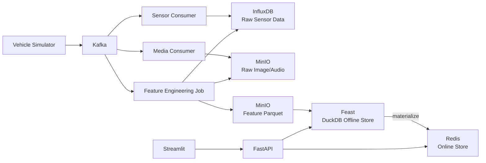

# 개요

- Feature Store: Feast
    - Offline Store : DuckDB + Parquet on MinIO
    - Online Store: Redis
- Raw Object: MinIO
- Raw Time-series: InfluxDB
- Streaming: Kafka
- Backend: FastAPI
- Frontend: Streamlit

<aside>
☑️

- offline store로 왜 duckDB를 선택했나?
    
    Offline store는 historical_features를 추적하고 관리할 수 있어야 하는데 postgresql은 이러한 개념을 구현하려면 조금 복잡도가 생긴다. 
    
    feature engineering을 하면 다음과 같은 형태로 산출물이 나온다.
    
    ```
    sensor_features.parquet
    image_features.parquet
    audio_features.parquet
    ```
    
    이러한 데이터를 postgresql에 넣으면 다음 문제점이 생긴다.
    
    ```
    Parquet 생성
    → PostgreSQL table schema 정의
    → COPY 또는 insert
    → index 관리
    → timestamp/entity join 성능 고려
    → schema 변경 시 migration 관리
    ```
    
    반면 DuckDB + FileSource는 훨씬 단순하게 저장할 수 있다.
    
    ```
    Parquet 생성
    → Feast FileSource path 지정
    → FeatureView 등록
    → get_historical_features / materialize
    ```
    
    Feast offline store는 FileSource 자체를 읽을 수 있고 Parquet/Delta 형식을 지원하므로 postgresql은 이러한 지원이 안되기 때문에 duckDB가 더 적합한 것 같다. postgresql은 트랜잭션, 정규화, 메타데이터를 관리하는 쪽에 주 사용성이 높지 offline store에 대해서는 적합하지 않다. 현재 minIO(S3 호환)를 사용하고 있기 때문에 duckDB가 S3의 Parquet도 `read_parquet(’s3://bucket/file’)` 형태로 읽을 수 있기 때문에 확장성도 좋다.
    
    게다가 [공식 문서](https://docs.feast.dev/reference/offline-stores/postgres)에 PostgreSQL offline store는 full test coverage를 달성하지 않으므로 완전한 안정성을 가정하지 말라고 명시되어 있다.
    
</aside>

# 아키텍처



## 데모 시나리오

자율주행 차량 위험도 예측용 Feature Store 데모

> 예측 목표: vehicle_id 기준으로 현재 주행 위험도 risk_score를 예측한다.
> 
> - (예측 결과는 단순히 rule-based or dummy model 사용)
>     
>     ```
>     risk_score =
>       obstacle_distance_min이 낮을수록 증가
>       avg_speed_10s가 높을수록 증가
>       sensor_missing_rate가 높을수록 증가
>       pedestrian_count가 많을수록 증가
>       siren_detected가 true면 증가
>     ```
>     

```
차량 센서 / 이미지 / 음성 이벤트 수집
→ Raw data 저장
→ Feature Engineering
→ Offline Feature Store 저장
→ Training Dataset 생성
→ Online Store materialize
→ FastAPI에서 실시간 feature 조회
→ Streamlit에서 위험도 예측 결과 확인
```

Feast의 offline store는 학습 데이터셋 생성과 online store materialization에 사용됩니다. 공식 문서에서도 offline store의 주요 목적을 **time-series feature 기반 training dataset 생성**과 **online store로 feature를 materialize하는 것**으로 설명합니다. 또한 Feast의 FileSource는 disk 또는 S3상의 파일을 data source로 사용할 수 있고, 현재 Parquet과 Delta 형식을 지원합니다. Online store는 low-latency feature serving을 위해 사용되며, feature value는 materialization을 통해 online store로 적재됩니다.

### 데모에서 보여줄 핵심 개념

| 구분 | 보여줄 내용 |
| --- | --- |
| Raw Data | Kafka 이벤트가 MinIO, InfluxDB에 저장됨 |
| Feature Engineering | Raw data에서 feature table 생성 |
| Offline Store | 과거 feature로 학습 데이터셋 생성 |
| Online Store | latest offline features를 Redis online store로 incremental materialize |
| Serving | FastAPI가 Feast를 통해 online feature 조회 후 예측 |

# Feature 설계

## Entity

처음에는 단순하게 갑니다.

```
vehicle=Entity(
name="vehicle",
join_keys=["vehicle_id"],
)
```

추후 확장하면 다음처럼 나눌 수 있습니다.

```
vehicle_id
drive_session_id
sensor_id
camera_id
```

하지만 데모에서는 `vehicle_id` 하나면 충분합니다.

---

## Feature View 1: Sensor Features

원천 데이터:

```
InfluxDB
```

Feature 산출물:

```
s3://mlops-features/sensor_features/
```

Schema:

| 컬럼 | 타입 | 설명 |
| --- | --- | --- |
| avg_speed_10s | float | 최근 10초 평균 속도 |
| accel_std_10s | float | 최근 10초 가속도 표준편차 |
| obstacle_distance_min | float | 최근 10초 최소 장애물 거리 |
| lidar_point_count | int | 라이다 포인트 수 |
| sensor_missing_rate | float | 센서 결측률 |

`vehicle_id`는 entity join key로 관리하고, `event_timestamp`는 `FileSource.timestamp_field`로 관리합니다.

---

## Feature View 2: Image Features

원천 데이터:

```
MinIO image object
```

Feature 산출물:

```
s3://mlops-features/image_features/
```

Schema:

| 컬럼 | 타입 | 설명 |
| --- | --- | --- |
| object_count | int | 감지 객체 수 |
| pedestrian_count | int | 보행자 수 |
| lane_detect_score | float | 차선 인식 신뢰도 |

`image_uri`는 Feast feature가 아니라 raw trace metadata로 관리합니다.

실제 이미지 모델을 돌리지 않아도 됩니다.

데모에서는 simulator가 `object_count`, `pedestrian_count`, `lane_detect_score`를 생성해도 충분합니다.

---

## Feature View 3: Audio Features

원천 데이터:

```
MinIO audio object
```

Feature 산출물:

```
s3://mlops-features/audio_features/
```

Schema:

| 컬럼 | 타입 | 설명 |
| --- | --- | --- |
| noise_level | float | 주변 소음 레벨 |
| siren_detected | bool | 사이렌 감지 여부 |

`audio_uri`는 Feast feature가 아니라 raw trace metadata로 관리합니다.

# 데모 화면 구성

Streamlit은 5개 탭으로 구성하는 것을 추천합니다.

## 7.1 Event Simulator 탭

기능:

```
- 차량 ID 선택
- 이벤트 생성 버튼
- Kafka publish 상태 확인
- 이벤트 payload 미리보기
```

예시 화면:

```
Vehicle ID: V001
Scenario:
  [ ] Normal Driving
  [ ] Heavy Traffic
  [ ] Pedestrian Nearby
  [ ] Sensor Missing
  [ ] Emergency Vehicle Nearby

[Generate Event]
```

---

## 7.2 Raw Data 탭

기능:

```
- InfluxDB에 저장된 sensor row count 확인
- MinIO에 저장된 image/audio object 목록 확인
- 최근 Kafka event payload 확인
```

핵심 메시지:

> Feature Store가 raw data를 대체하는 것이 아니라, raw data에서 계산된 feature를 관리한다.
> 

---

## 7.3 Offline Feature 탭

기능:

```
- MinIO feature parquet 목록 조회
- vehicle_id별 historical feature 조회
- training dataset 생성 버튼 (historical 기반 API 호출)
```

보여줄 데이터:

| vehicle_id | event_timestamp | avg_speed_10s | obstacle_distance_min | pedestrian_count | siren_detected |
| --- | --- | --- | --- | --- | --- |
| V001 | 2026-05-21 10:00:00 | 42.1 | 18.4 | 0 | false |
| V001 | 2026-05-21 10:01:00 | 51.3 | 8.2 | 2 | false |
| V002 | 2026-05-21 10:02:00 | 33.8 | 21.5 | 1 | true |

---

## 7.4 Materialization 탭

기능:

```
- feast apply 실행 상태
- end_date(optional) 입력
- feast materialize-incremental 실행 버튼
- Redis에 적재된 vehicle_id 확인
```

핵심 메시지:

> latest offline features를 Redis online store로 incremental 적재한다.
> start 범위는 Feast registry state가 관리한다.
> 

---

## 7.5 Online Serving 탭

기능:

```
- vehicle_id 입력
- Feast online feature 조회
- risk_score 계산
- 위험도 결과 표시
```

예시:

```
Vehicle ID: V001

Online Features:
- avg_speed_10s: 51.3
- obstacle_distance_min: 8.2
- pedestrian_count: 2
- siren_detected: false
- sensor_missing_rate: 0.03

Prediction:
risk_score = 0.78
risk_level = HIGH
```

# API 설계

FastAPI는 처음에는 아래 정도면 충분합니다.

## 이벤트 생성

```
POST /api/events/simulate
```

역할:

```
- vehicle_id 기준 mock event 생성
- Kafka topic으로 publish
```

---

## Raw data 상태 조회

```
GET /api/raw/status
```

응답 예시:

```
{
  "influx_sensor_count":1200,
  "minio_image_count":40,
  "minio_audio_count":40
}
```

---

## Feature Engineering 실행

```
POST /api/features/build
```

역할:

```
- InfluxDB sensor data 조회
- MinIO media metadata 조회
- feature dataframe 생성
- Parquet로 MinIO에 저장
```

---

## Offline Feature 조회

```
GET /api/features/offline?vehicle_id=V001
```

역할:

```
- Feast get_historical_features 또는 parquet preview
- 기본 preview interval: 10m
- 데모에서는 preview 수준으로 시작 가능
```

---

## Training Dataset 생성

```
POST /api/features/training-dataset
```

요청:

```
{
  "output_path":"./data/training_dataset.parquet",
  "hours":168,
  "interval_minutes":60,
  "vehicle_ids":["V001","V002","V003"]
}
```

역할:

```
- Feast get_historical_features 기반 point-in-time dataset 생성
- synthetic label 생성 (RiskModelService 규칙)
- 기본 산출물 parquet
```

---

## Materialize 실행

```
POST /api/features/materialize
```

요청 (optional):

```
{
  "end_date":"2026-05-24T12:00:00Z"
}
```

역할:

```
- feast materialize-incremental(end_date) 실행
- Redis online store에 latest offline feature 적재
```

---

## Online Feature 조회

```
GET /api/features/online?vehicle_id=V001
```

역할:

```
- Feast get_online_features 호출
```

---

## 예측

```
POST /api/predict
```

요청:

```
{
  "vehicle_id":"V001"
}
```

응답:

```
{
  "vehicle_id":"V001",
  "features": {
    "avg_speed_10s":51.3,
    "obstacle_distance_min":8.2,
    "pedestrian_count":2,
    "siren_detected":false,
    "sensor_missing_rate":0.03
  },
  "risk_score":0.78,
  "risk_level":"HIGH"
}
```

# Repository 구조

```
mlops-feature-store-demo/
├── docker-compose.yml
├── README.md
├── .env
│
├── backend/
│   ├── app/
│   │   ├── main.py
│   │   ├── api/
│   │   │   ├── events.py
│   │   │   ├── raw.py
│   │   │   ├── features.py
│   │   │   └── predict.py
│   │   ├── services/
│   │   │   ├── kafka_producer.py
│   │   │   ├── influx_service.py
│   │   │   ├── minio_service.py
│   │   │   ├── feature_builder.py
│   │   │   ├── feast_service.py
│   │   │   └── risk_model.py
│   │   └── schemas/
│   │       ├── event.py
│   │       ├── feature.py
│   │       └── prediction.py
│   └── requirements.txt
│
├── frontend/
│   ├── app.py
│   └── requirements.txt
│
├── feast_repo/
│   ├── feature_store.yaml
│   ├── entities.py
│   ├── feature_views.py
│   └── features/
│
├── consumers/
│   ├── sensor_consumer.py
│   ├── media_consumer.py
│   └── requirements.txt
│
├── jobs/
│   ├── build_features.py
│   ├── materialize.py
│   └── generate_training_dataset.py
│
├── simulator/
│   ├── vehicle_event_simulator.py
│   └── sample_payloads/
│
└── scripts/
    ├── init_minio.sh
    ├── init_influxdb.sh
    ├── feast_apply.sh
    ├── run_materialize.sh
    └── seed_demo_data.sh
```

---

# 10. Docker Compose 서비스

최소 구성:

```yaml
services:
  kafka:
  minio:
  influxdb:
  redis:
  backend:
  frontend:
  sensor-consumer:
  media-consumer:
  kafka-ui:
  minio-console:
  redisinsight:

```

데모에는 관리 UI가 있으면 좋습니다.

| UI | 목적 |
| --- | --- |
| MinIO Console | 이미지/음성 object 확인 |
| Kafka UI | topic 메시지 확인 |
| RedisInsight | online feature 적재 확인 |
| InfluxDB UI | sensor time-series 확인 |

---

# 11. Feast 설정 예시

## `feature_store.yaml`

```yaml
project: vehicle_risk_demo
provider: local
registry: data/registry.db

offline_store:
  type: duckdb

online_store:
  type: redis
  connection_string: redis:6379
```

## Feature Source 예시

```python
from feast import FileSource
from feast.data_format import ParquetFormat

sensor_source = FileSource(
    name="sensor_features_source",
    path="s3://mlops-features/sensor_features/",
    timestamp_field="event_timestamp",
    file_format=ParquetFormat(),
)
```

## Feature View 예시

```python
from feast import Entity, FeatureView, Field
from feast.types import Float32, Int64, String, Bool
from datetime import timedelta

vehicle = Entity(
    name="vehicle",
    join_keys=["vehicle_id"],
)

sensor_features = FeatureView(
    name="sensor_features",
    entities=[vehicle],
    ttl=timedelta(hours=24),
    schema=[
        Field(name="avg_speed_10s", dtype=Float32),
        Field(name="accel_std_10s", dtype=Float32),
        Field(name="obstacle_distance_min", dtype=Float32),
        Field(name="lidar_point_count", dtype=Int64),
        Field(name="sensor_missing_rate", dtype=Float32),
    ],
    source=sensor_source,
)
```

# feature engineering pipeline

카프카를 사용해서 전송한다.
