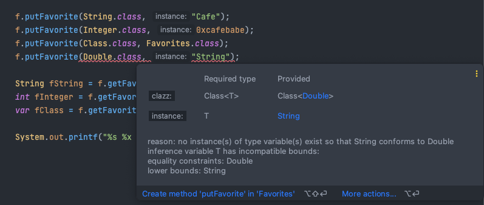
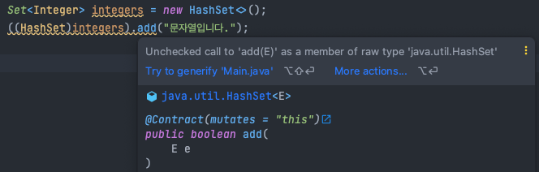
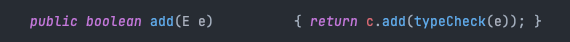
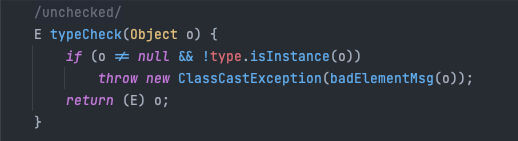

1. `Favorite.putFavorite(Class<T> type, T instance)`
위 매개변수는 컴파일 시점에 알려주기 때문에 악의적인 클라이언트가 요상한 값을 넣더라도 방지해준다.

  
`HashSet<Integer>` 에 String을 넣는건 쉽다.

IDE가 똑똑해서 잡아주는것 뿐이지 컴파일 에러는 나지 않는다.

더욱 더 타입 안정성을 보장하는 방법이 있다.
```java
public <T> void putFavorite(Class<T> clazz, T instance) {
        favorites.put(clazz, instance);
    }
```
기존 putFavorites 메서드는 다음과 같이 변경하는 것이다.
```java
public <T> void putFavorite(Class<T> clazz, T instance) {
        favorites.put(Objects.requireNonNull(clazz), clazz.cast(instance));
    }
```
위와 같이 변경함으로써 인스턴스를 추가할 때 한번 더 타입을 검증하기 때문에 타입 세이프함을 보장할 수 있다.

이와 같은 방법을 적용한게 바로 checkedSet, checkedList, checkedMap과 같은 컬렉션 래퍼들이 있다.

