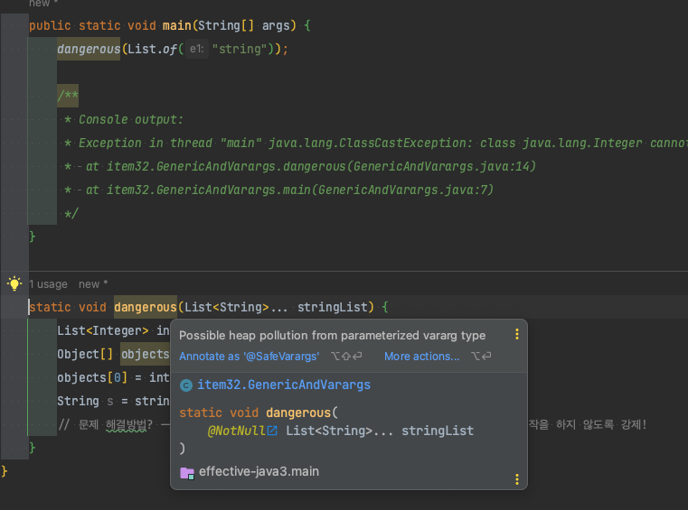

## varargs Heap Pollution (가변인수 힙 오염)


아래 두가지 어노테이션으로 경고를 숨길 수 있다. (해당 어노테이션은 varargs가 힙 오염을 일으키지 않는 다는 전제가 꼭 있어야 한다!)
### 자바7 이전 - @SuppressWarnings("unchecked")
```java
@SuppressWarnings("unchecked")
static void dangerous(List<String>... stringList) {...}
```

### 자바 7 이후 - @SafeVarargs
다시 한번 말하지만 해당 메서드가 안전하다는게 꼭 보장될 때만 사용해야한다.
```java
@SafeVarargs
static void dangerous(List<String>... stringList) {...}
```

### varargs는 제네릭 배열이 만들어진다.
위에서 힙 오염이 발생해서 위험하다는 것을 알게되었다. 그렇다면 어떻게 사용해야 안전할까? 가변인수는 전달 용도로만 사용해야 안전하다고 할 수 있다.

그렇다면 다음 코드는 안전할까?
```java
static <T> T[] toArray(T... args) {
    return args;
}
```
보기에 아무것도 안하므로 안전해보이지만 자신의 varargs 참조를 넘기고 있다. 이렇게 되면 힙 오염을 이 메서드를 호출한 쪽으로 전이하는 결과를 낳게 된다.

```java
public static void main(String[]args){
    String[] strings = pickTwo("s1", "s2", s3");
}

static <T> T[] pickTwo(T a, T b, T c) {
    System.out.println("pickTwo -> a: " + a.getClass() + " b: " + b.getClass() + " c: " + c.getClass());
    switch (ThreadLocalRandom.current().nextInt(3)) {
        case 0: return toArray(a, b);
        case 1: return toArray(b, c);
        case 2: return toArray(c, a);
    }
    throw new AssertionError();
}

static <T> T[] toArray(T... args) {
    System.out.println("toArray -> args: " + args.getClass());
    return args;
}
```

위 결과는 다음과 같이 에러가 발생한다.
```log
pickTwo -> a: class java.lang.String b: class java.lang.String c: class java.lang.String
toArray -> args: class [Ljava.lang.Object;

Exception in thread "main" java.lang.ClassCastException: class [Ljava.lang.Object; cannot be cast to class [Ljava.lang.String; ([Ljava.lang.Object; and [Ljava.lang.String; are in module java.base of loader 'bootstrap')
	at item32.VarargsDangerousUse.main(VarargsDangerousUse.java:7)
```

pickTwo는 항상 Object[]를 반환한다. 그렇기 때문에 main문에서 String[]로 변환하는 과정에서 ClassCastException이 발생한 것이다.

왜 pickTwo는 Object[]를 반환할까? 콜스택이 2단계나 있기 때문에 컴파일러는 호출한 varargs의 타입을 잊어버린다. 그렇기 때문에 모든 타입을 수용할 수 있는 Object 타입으로 형변환해서 반환한다.

그렇다면 어떻게 안전하게 변경할 수 있을까?
item28과 같이 배열 대신 리스트를 사용하면 된다.

```java
public static void main(String[] args) {
    List<String> strings = pickTwo("s1", "s2", "s3");
    System.out.println(strings);
}

static <T> List<T> pickTwo(T a, T b, T c) {
    System.out.println("pickTwo -> a: " + a.getClass() + " b: " + b.getClass() + " c: " + c.getClass());
    switch (ThreadLocalRandom.current().nextInt(3)) {
        case 0: return List.of(a, b);
        case 1: return List.of(b, c);
        case 2: return List.of(c, a);
    }
    throw new AssertionError();
}
```

위 코드는 받은 매개변수를 리스트로 변환하여 반환하기 때문에 제네릭과 잘 어우러져서 사용할 수 있게 된다.
배열은 제네릭과 함께 쓰기 힘들다. 그럴 때는 위 예제와 같이 리스트를 이용해서 제네릭의 이점을 살리면 좋을 것 같다.