> 목표
> - 코루틴에 동작방식을 이해할 수 있다.
> - 간단한 파이썬 바이트 코드를 다룰 수 있다.
> - `Value Stack`, `Call Stack`, `Frame` 객체에 대해서 얇고 넓게 배운다.


# Coroutine이란 무엇인가?
환경
- python 3.10.14

다음은 간단한 코루틴 예제가 있습니다. 실행 결과는 어떻게 될까요?
```python
# coroutine.py
import asyncio

async def coroutine1():
    print("coroutine1 first entry point")
    await asyncio.sleep(1)
    print("coroutine1 second entry point")

async def coroutine2():
    print("coroutine2 first entry point")
    await asyncio.sleep(2)
    print("coroutine2 second entry point")

loop = asyncio.get_event_loop()
loop.create_task(coroutine1())
loop.create_task(coroutine2())
loop.run_forever()
```
실행결과:
```bash
# coroutine1 first entry point
# coroutine2 first entry point
# coroutine1 second entry point
# coroutine2 second entry point
```
실행결과를 보면 coroutine1과 coroutine2가 섞여서(?) 출력이 되었습니다. 왜 이렇게 동작하는지에 대해서 완벽하게 이해하는게 목표입니다!

## Resuming & Suspending
코루틴을 알기 위해서는 실행(또는 이전 지점 재개)과 일시중지로 작동하는 것을 알아야 합니다.
이전 예제를 다시 살펴봅시다.
```python
# coroutine.py
async def coroutine1():
->  print("coroutine1 first entry point")
<-  await asyncio.sleep(1)
->  print("coroutine1 second entry point")

async def coroutine2():
->  print("coroutine2 first entry point")
<-  await asyncio.sleep(2)
->  print("coroutine2 second entry point")
```
- `->`: Resuming (실행 또는 재개)
- `<-`: Suspending (일시중지)

실행결과를 보면, coroutine1 함수의 첫 번째 print문이 실행되고, 그 다음 라인에 await를 만나 1초동안 일시정지 상태가 됩니다. 마찬가지로 coroutine2 함수의 첫 번째 print문이 실행되고, await를 만나 2초 일시정지 되는 동안 coroutine1의 마지막 print -> coroutine2의 마지막 print가 실행되고 종료되게 됩니다.

그렇다면 여기서 의문이 들 수 있습니다. await를 만나면 일시정지 상태가 되는가? 반은 맞고 반은 틀립니다. await는 일시정지가 될 가능성이 있다는 `힌트`일 뿐입니다. 

# Python Frame Object & Byte Code
후반부에서 다룰 코루틴이 함수를 일시중지하고 재개하는 메커니즘을 이해하기 위해서는 먼저 Frame 객체 그리고 바이트 코드를 알아야 합니다. 먼저 Frame 객체에 대해서 알아보도록 하겠습니다.
  

## Frame Object
  
[Frame](https://docs.python.org/3/reference/datamodel.html#frame-objects) 객체는 함수를 실행하기 위해 필요한 정보들을 담고 있는 객체입니다.  

직접해보는게 이해가 빠르기 때문에 간단한 실습을 통해서 이해해봅시다. inspect 모듈을 import하면 현재 프레임을 얻어올 수 있게 됩니다.
```python
# frame_example.py
import inspect

frame = None

def func():
    global frame
    x = 10
    y = 20
    print(x + y)
    frame = inspect.currentframe()

func()
```
이제 전역 변수 frame에 func 마지막 프레임이 담겼을 것 입니다.

[Frame](https://docs.python.org/3/reference/datamodel.html#frame-objects) 객체에는 여러 메서드들이 있지만 중점적으로 살펴볼 함수들은 다음과 같습니다.
- f_locals
- f_back
- f_lasti
- f_code

</br>

`f_locals`  
```python
print(f"frame.f_locals: {frame.f_locals}")
>> frame.f_locals: {'x': 10, 'y': 20}
```
f_locals는 지역 변수의 상태를 dictionary 형태로 저장하고 있습니다.  

`f_back`
```python
print(f"frame.f_back: {frame.f_back}")
>> frame.f_back: <frame at 0x103045a40, file '/Users/shlee/workspaces/study/iseunghan-Lab/python-deep-dive-into-coroutine/frame_example.py', line 14, code <module>>
```
f_back은 이전 스택 프레임 즉, 이 프레임을 호출한 caller를 가리킵니다. 이 f_back 정보를 들고 있기 때문에 현재 프레임이 종료되면 f_back을 통해 이전 프레임으로 돌아갈 수 있습니다.

[예제 코드](https://github.com/iseunghan/iseunghan-Lab/blob/main/python-deep-dive-into-coroutine/callstack_example.py)에 대한 Call Stack을 좀 더 이해하기 쉽게 짤로 표현해봤습니다.  

새로운 Call (함수 호출)이 발생하면 Frame이 생기게 되고, f_back에는 caller의 정보가 담기게 됩니다. 그 덕분에 함수가 완전히 종료되면 f_back에 있는 정보를 따라 이전 프레임으로 돌아갈 수 있게 됩니다.

`f_lasti`
```python
print(f"frame.f_lasti: {frame.f_lasti}")
>> frame.f_lasti: 30
```
f_lasti의 값이 30이 나왔습니다. 이게 무슨 값인지 알기 위해서는 바이트 코드를 까봐야 합니다. 바이트 코드는 [dis](https://docs.python.org/3/library/dis.html) 모듈을 import해서 `disassemble` 할 수 있습니다.

```python
# byte_code_example.py
import inspect

def func():
    global frame
    x = 10
    y = 20
    print(x + y)
    frame = inspect.currentframe()

func()

print(f"frame.f_lasti: {frame.f_lasti}")

import dis
dis.dis(func)
```

실행결과:
```text
30
frame.f_lasti: 30
6           0 LOAD_CONST               1 (10)
            2 STORE_FAST               0 (x)

7           4 LOAD_CONST               2 (20)
            6 STORE_FAST               1 (y)

8           8 LOAD_GLOBAL              0 (print)
            10 LOAD_FAST                0 (x)
            12 LOAD_FAST                1 (y)
            14 BINARY_ADD
            16 CALL_FUNCTION            1
            18 POP_TOP

9          20 LOAD_GLOBAL              1 (inspect)
            22 LOAD_METHOD              2 (currentframe)
            24 CALL_METHOD              0
            26 STORE_GLOBAL             3 (frame)
            28 LOAD_CONST               0 (None)
            30 RETURN_VALUE
```
lasti는 마지막 라인에 있는 RETURN_VALUE의 30을 가리킵니다. 즉, Frame의 가장 최근에 실행된 바이트 코드의 인덱스(offset)를 의미합니다.

byte 코드를 읽는 방법  

[공식문서](https://docs.python.org/3/library/dis.html#python-bytecode-instructions)에 따르면, 각 컬럼에 대해서는 다음과 같이 정의할 수 있습니다.

| 컬럼 이름                | 설명                                            | 예시 출력                                 |                                              |
| -------------------- | --------------------------------------------- | ------------------------------------- | -------------------------------------------- |
| **starts\_line**     | 해당 바이트코드 명령어가 시작되는 소스 코드의 줄 번호. 새로운 줄에서만 표시됨. | `2`, `None`                           |                                              |
| **offset**           | 바이트코드에서 명령어의 위치를 나타내는 오프셋. 보통 2씩 증가함.         | `0`, `2`, `4` 등                       |                                              |
| **opname**           | 바이트코드 명령어의 이름 (Operation Code Name).          | `LOAD_FAST`, `CALL`, `RETURN_VALUE` 등 |                                              |
| **arg(또는 oparg)**              | 명령어에 전달되는 인자 값. 특정 명령어에서만 표시됨.                | `0`, `1` 등                            |                                              |
| **argval(또는 opargval)**           | 인자의 실제 값. 예: 변수명, 상수 값 등.                     | `'x'`, `'Hello'` 등                    |                                              |
  

`f_code`
```python
print(f"frame.f_code: {frame.f_code}")
>> frame.f_code: <code object func at 0x101bdeb80, file "/Users/shlee/workspaces/study/iseunghan-Lab/python-deep-dive-into-coroutine/frame_example.py", line 3>
```

### code
f_code는 function의 `__code__`와 동일한 객체입니다.
```python
frame.f_code is func.__code__
>> True
```

code 객체에도 여러 가지 함수가 있지만 중점적으로 살펴볼 함수는 다음과 같습니다.
- co_const
- co_names
- co_varnames
- co_code

하나씩 차근차근 살펴보도록 하겠습니다.


`co_code`  
```python
print(func.__code__.co_code)
>> b'd\x01}\x00d\x02}\x01t\x00|\x00|\x01\x17\x00\x83\x01\x01\x00t\x01\xa0\x02\xa1\x00a\x03d\x00S\x00'
```
co_code를 출력해보니 바이트열이 담겨있습니다. 이걸 list로 변환해서 출력해보면?
```python
print(list(func.__code__.co_code))
>> [100, 1, 125, 0, 100, 2, 125, 1, 116, 0, 124, 0, 124, 1, 23, 0, 131, 1, 1, 0, 116, 1, 160, 2, 161, 0, 97, 3, 100, 0, 83, 0]
```
알 수 없는 숫자열이 담겨있습니다. 바로 op_code와 op_arg를 나타냅니다. dis 모듈을 이용해서 func를 바이트 코드로 변환하여 비교해볼까요?


co_code의 숫자값들이 정말 `[op_code, op_arg, ...]`를 나타내는지 확인해보겠습니다.
```python
import opcode

opcode.opname[100]
>> LOAD_CONST

opcode.opname[125]
>> STORE_FAST
```
dis 모듈로 확인한 바이트 코드의 op_name과 동일한 것을 확인할 수 있습니다.   

정리해보자면, co_code는 op_code와 op_arg를 순서대로 나열시킨 바이트열이라고 할 수 있습니다.


`co_consts`
함수 내부에서 사용중인 상수들을 나타냅니다.
```python
print(func.__code__.co_consts)
>> (None, 10, 20)
```
여기서 None은 함수의 기본 반환 값으로 기존 반환 값 여부 상관없이 항상 None 고정입니다.

만일 co_consts에는 함수의 리턴값 또는 매개변수에 대한 정보는 포함되지 않습니다.
```python
# frame_f_code_example.py
print(f"func.co_consts: {func.__code__.co_consts}")
# >> func.co_consts: (None, 10, 20)

def func2(arg2="world") -> str:
    return f"Hello, {arg2}"

print(f"func2.co_consts: {func2.__code__.co_consts}")
# >> func2.co_consts: (None, 'Hello, ')
```

`co_varnames`
```python
# frame_f_code_example.py
func.__code__.co_varnames
# >> ('x', 'y')
```
함수 내의 지역변수명을 튜플 형태로 저장합니다.

`co_names`
```python
func.__code__.co_names
# >> ('print', 'inspect', 'currentframe', 'frame')
```
함수 내의 전역변수명을 튜플의 형태로 저장합니다.
print, inspect 등의 함수들은 built-in 함수라서 전역변수 취급 되었습니다. 

## byte 코드, frame을 함께 살펴봅시다.
자 바이트 코드가 어떻게 동작하는지 지금부터 Step-by-Step으로 살펴보겠습니다. 
~~(저도 이해가 잘 가지 않아서 직접 그려가면서 따라가보았습니다.)~~

바이트 코드는 다음과 같이 예제 코드를 살펴보겠습니다.
```python
# byte_code_with_frame_ex.py
def func():
    x = 10
    y = 20
    print(x + y)

import dis
dis.dis(func)
```

실행결과:
```text
2           0 LOAD_CONST               1 (10)
            2 STORE_FAST               0 (x)

3           4 LOAD_CONST               2 (20)
            6 STORE_FAST               1 (y)

4           8 LOAD_GLOBAL              0 (print)
            10 LOAD_FAST                0 (x)
            12 LOAD_FAST                1 (y)
            14 BINARY_ADD
            16 CALL_FUNCTION            1
            18 POP_TOP
            20 LOAD_CONST               0 (None)
            22 RETURN_VALUE
```

1. 먼저 LOAD_CONST입니다. op_arg(1)는 LOAD_CONST를 보시면 co_const를 가리킨다는 것을 쉽게 이해하실 수 있습니다. 인덱스 1의 value 10을 취해서 value_stack에 밀어넣습니다.
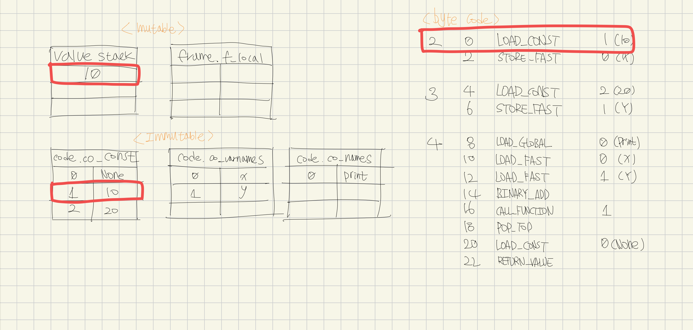
2. STORE_FAST는 현재 Value_stack에 있는 상단 값을 뽑아서 op_arg(0)에 저장시킵니다. 여기서 or_arg는 co_varnames를 참조합니다.
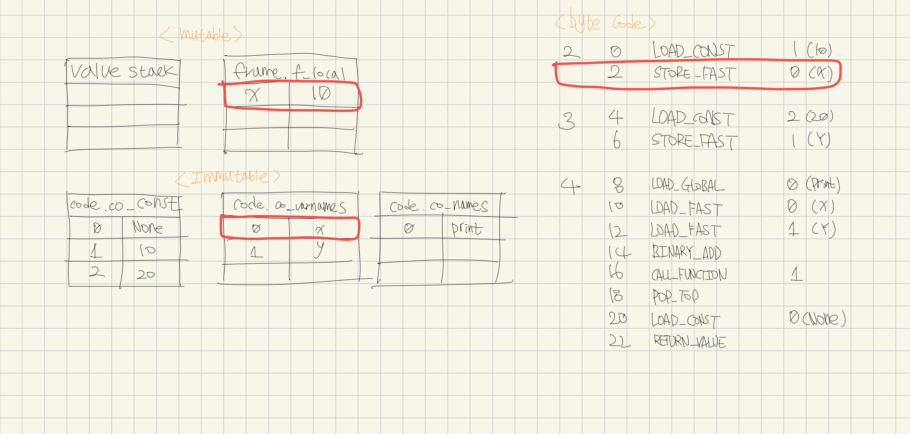
3. 1번과 마찬가지로 op_arg(2)를 co_const에서 가져와서 value_stack에 밀어넣습니다.
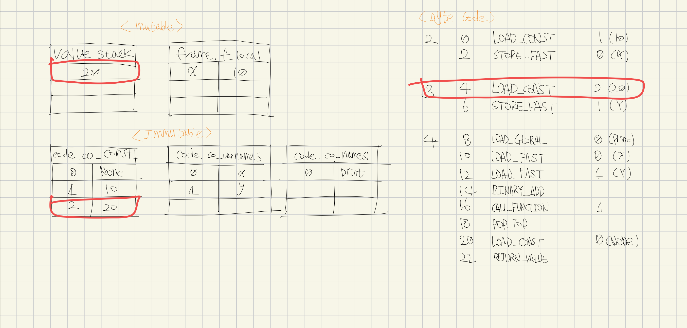
4. 2번과 마찬가지로, 현재 Value_stack에 있는 상단 값을 뽑아서 op_arg(1) 즉, y에 20을 저장시킵니다.
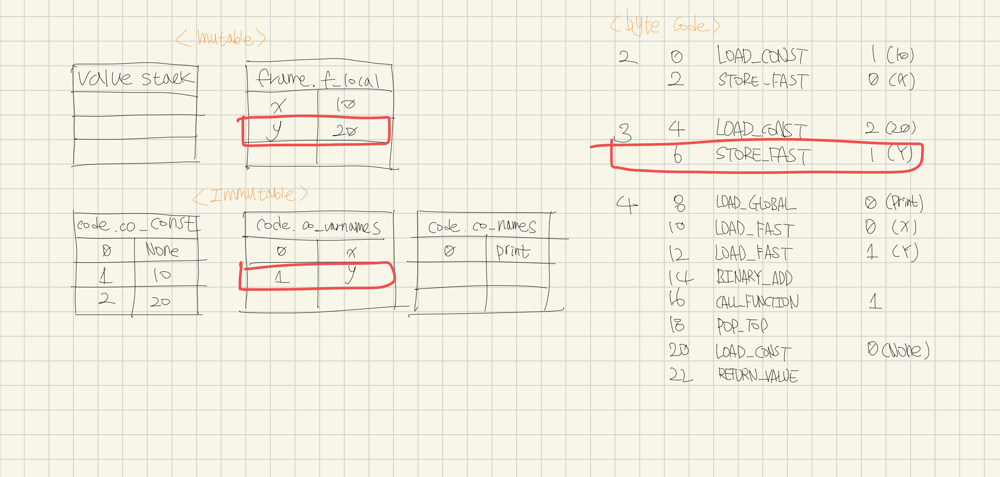
5. LOAD_GLOBAL은 co_names 즉, 전역변수를 로드하는 작업입니다. op_arg(0) -> print를 value_stack에 올립니다.
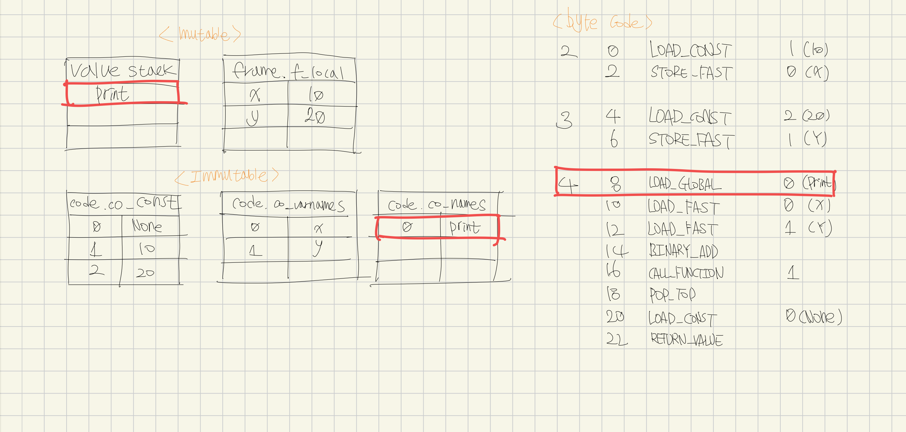
6. 10, 12번은 동일한 LOAD_FAST이므로 f_local에 있는 인덱스 0번과 1번 즉, `x=10, y=20`을 value_stack에 올립니다.
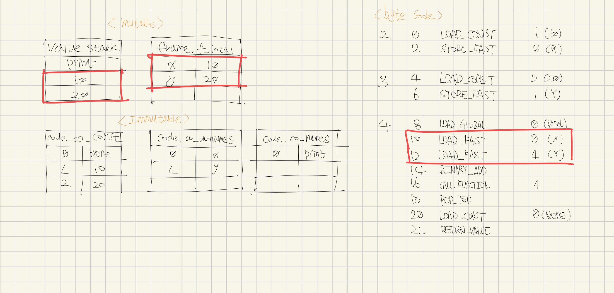
7. 10과 20을 pop한 뒤 BINARY_ADD를 수행한 결과인 30을 다시 넣습니다.
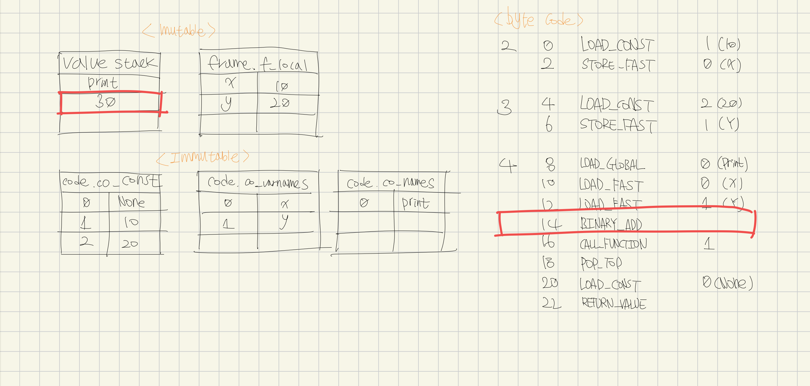
8. CALL_FUNCTION을 수행합니다. op_arg(1)의 의미는 함수를 호출하는데 사용하는 인자를 value_stack에서 1개를 사용하겠다는 것 입니다. 즉 print 함수에 30이 전달되어 실행됩니다.
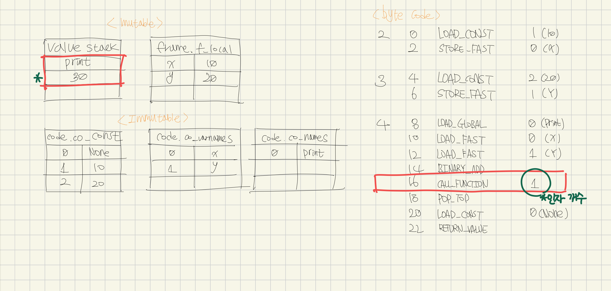
9. print 함수의 명시적 반환값이 없으므로 기본적으로 None을 리턴하게 됩니다. 사용하지 않는 값이므로 POP_TOP을 수행하여 제거해줍니다.
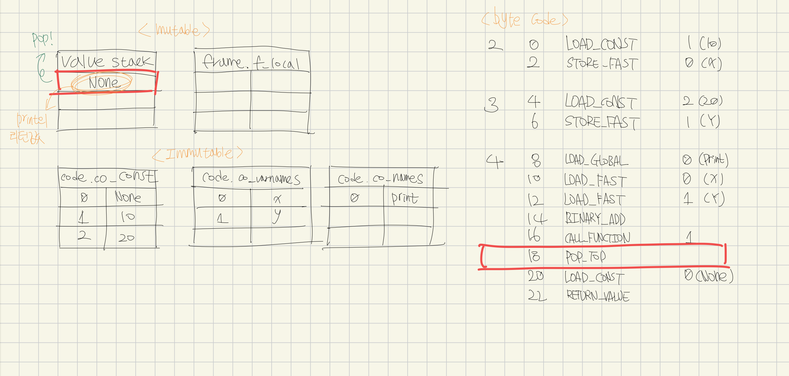
10. co_const의 0번 인덱스(None)를 LOAD_CONST를 수행합니다.
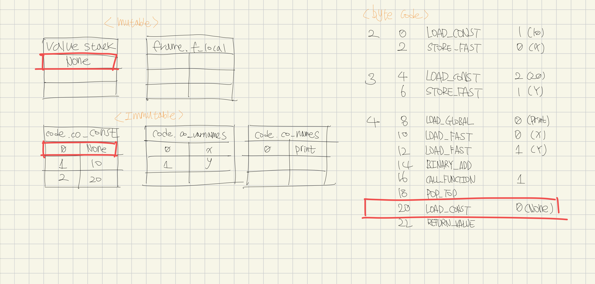
11. 현재 함수 func도 마찬가지로 반환값이 없으므로 None을 RETURN_VALUE 수행하고 종료됩니다.
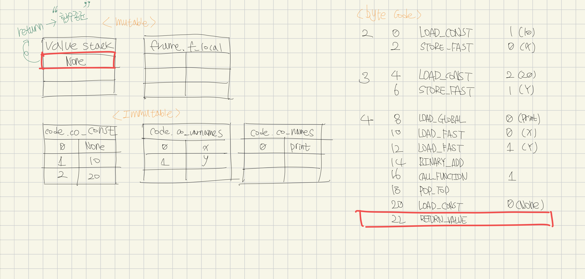

## coroutine 다시 살펴보기
> 여기서부터 실습은 python 3.12로 진행 하였습니다.

이후에 살펴볼 내용들을 이해하기 위한 바이트 코드를 이제는 읽을 수 있게 되었습니다. native coroutine 함수를 살펴보겠습니다.
```python
# coroutine.py
import asyncio

async def coroutine1():
    print("coro1 first entry point")
    await asyncio.sleep(1)
    print("coro1 second entry point")

import dis
dis.dis(coroutine1)
```

아래는 위 native coroutine 함수의 바이트 코드를 출력한 것 입니다.
```python
              4           0 RETURN_GENERATOR
              2 POP_TOP
              4 RESUME                   0

  5           6 LOAD_GLOBAL              1 (NULL + print)
             16 LOAD_CONST               1 ('coro1 first entry point')
             ...
        >>   72 SEND                     3 (to 82)
             76 YIELD_VALUE              2
             78 RESUME                   3
             80 JUMP_BACKWARD_NO_INTERRUPT     5 (to 72)
        >>   82 END_SEND
             84 POP_TOP
            ...
```
눈 여겨볼 부분은 await를 하는 부분의 바이트 코드가 YIELD로 해석된다는 점입니다. 이로써 내부적으로는 제네레이터 기반으로 동작한다는 것을 알 수 있습니다.

이제 Generator 기반 Coroutine 함수도 살펴볼까요?
> generator 기반 코루틴은 python 3.12 이후 버전부터 지원하지 않습니다. (ref. https://github.com/python/typeshed/issues/10116), 아래 예제가 정확하지 않을 수 있습니다 😭


```python
# generator-coroutine.py
def coroutine3():
    print("coroutine3 first entry point")
    yield from asyncio.sleep(1)
    print("coroutine3 second entry point")
```
> yield와 yield from 차이점은?
> yield from은 Generator 내부에서 또 다른 sub Generator를 실행하기 위해 사용합니다. 실행권한을 sub Generator에게 위임하고 Return 결과를 받을 수 있게 됩니다.


바이트 코드로 출력해서 살펴보면,
```python
8           0 RETURN_GENERATOR
              2 POP_TOP
              4 RESUME                   0

  9           6 LOAD_GLOBAL              1 (NULL + print)
             16 LOAD_CONST               1 ('coroutine3 first entry point')
             18 CALL                     1
             26 POP_TOP

 10          28 LOAD_GLOBAL              3 (NULL + asyncio)
             38 LOAD_ATTR                4 (sleep)
             58 LOAD_CONST               2 (1)
             60 CALL                     1
             68 GET_YIELD_FROM_ITER
             70 LOAD_CONST               0 (None)
        >>   72 SEND                     3 (to 82)
             76 YIELD_VALUE              2
             78 RESUME                   2
             80 JUMP_BACKWARD_NO_INTERRUPT     5 (to 72)
        >>   82 END_SEND
             84 POP_TOP
            ...
```

`yield from asyncio.sleep(1)` 함수는 다음과 같이 해석되고 있습니다.
```python
10          28 LOAD_GLOBAL              3 (NULL + asyncio)
             38 LOAD_ATTR                4 (sleep)
             58 LOAD_CONST               2 (1)
             60 CALL                     1
```
asyncio를 로드해서 sleep 함수 그리고 매개변수 1을 넘겨 call 해줍니다.
```python
             68 GET_YIELD_FROM_ITER
             70 LOAD_CONST               0 (None)
        >>   72 SEND                     3 (to 82)
             76 YIELD_VALUE              2
```
그런 다음, GET_YIELD_FROM_ITER를 통해 awaitable을 iterator로 변환 (__await__())하고, Send를 통해 중첩된 서브 제네레이터를 실행한 다음 YIELD를 통해 값을 밖으로 밀어넣고 일시중지 시킵니다.

어떻게 yield를 통해 일시정지되고 다시 재개할 수 있는걸까요? Generator 함수를 살펴봅시다.
```python
# generator.py
def generator():
    recv = yield 1
    return recv

import dis
dis.dis(generator)

gen = generator()
print(gen.send(None)) # 1
```

byte code는 다음과 같습니다.
```python
  1           0 RETURN_GENERATOR
              2 POP_TOP
              4 RESUME                   0

  2           6 LOAD_CONST               1 (1)
              8 YIELD_VALUE              1
             10 RESUME                   1
             12 STORE_FAST               0 (recv)

  3          14 LOAD_FAST                0 (recv)
             16 RETURN_VALUE
        >>   18 CALL_INTRINSIC_1         3 (INTRINSIC_STOPITERATION_ERROR)
             20 RERAISE                  1
```
`gen.send(None)`를 실행하면 yield까지 실행되고 1이 send 호출자에게 전달되고 suspend 되게 됩니다. (이것은 제네레이터 동작방식을 이미 알고 있다면 이해하고 계실겁니다)

실제로 yield 부분에서 일시정지 되었는지 Generator 함수의 Frame 객체를 얻어와서 확인해보겠습니다.

```python
# generator.py
lasti = gen.gi_frame.f_lasti
print(f">> f_lasti: {lasti}")

code = gen.gi_code.co_code
op = code[lasti]

import opcode
print(f">> op: {op}, opname: {opcode.opname[op]}")
```
실행결과: 
```python
>> f_lasti: 8
>> op: 150, opname: YIELD_VALUE
```
frame의 최근의 실행된 바이트코드의 인덱스는 8으로 확인되었고, code를 얻어와서 opname을 확인해보니 YIELD_VALUE인 것이 확인되었습니다!

send를 더 자세하게 살펴보기 위해 CPython 인터프리터 내부의 실제 send를 수행하는 함수를 살펴보도록 하겠습니다.

### CPython 내부 살펴보기 (gen_send)
gen.send()를 수행하면 실제로는 [genobject.send_ex](https://github.com/python/cpython/blob/3d396ab7591d544ac8bc1fb49615b4e867ca1c83/Objects/genobject.c#L298)함수가 실행됩니다. 내부에서는 다시 [genobject.send_ex_2](https://github.com/python/cpython/blob/3d396ab7591d544ac8bc1fb49615b4e867ca1c83/Objects/genobject.c#L192)함수를 호출하게 되는데요. 간단하게 살펴보면, gen_send_ex2를 수행해서 PYGEN_RETURN 상태가 된다면 조건문 내부를 수행하는 것 같습니다. gen_send_ex2에 넘겨준 result에 결과에 따라서 Generator를 StopIteration할지 결정하는 것 같습니다.
```c
static PyObject *
gen_send_ex(PyGenObject *gen, PyObject *arg, int exc, int closing)
{
    PyObject *result;
    if (gen_send_ex2(gen, arg, &result, exc, closing) == PYGEN_RETURN) {
        if (PyAsyncGen_CheckExact(gen)) {
            assert(result == Py_None);
            PyErr_SetNone(PyExc_StopAsyncIteration);
        }
        else if (result == Py_None) {
            PyErr_SetNone(PyExc_StopIteration);
        }
        else {
            _PyGen_SetStopIterationValue(result);
        }
        Py_CLEAR(result);
    }
    return result;
}
```

가장 중요한 [genobject.send_ex_2](https://github.com/python/cpython/blob/3d396ab7591d544ac8bc1fb49615b4e867ca1c83/Objects/genobject.c#L192)함수입니다. 너무 많아서 일부분만 발췌했습니다.
먼저 Thread로부터 ThreadState를 가져오고, 인자로 받은 generator의 `Frame` 객체를 가져옵니다.

그리고 send로 넘어온 arg를 삼항 연산자로 None 처리를 해준 다음 `_PyFrame_StackPush` 함수에 현재 Frame과 arg를 넘겨 Frame의 Value_Stack에 `Push`해줍니다. (이제 어떻게 generator yield 자리에 값이 치환 되는지 알게 되었습니다)


```c
static PySendResult
gen_send_ex2(PyGenObject *gen, PyObject *arg, PyObject **presult,
             int exc, int closing)
{
    PyThreadState *tstate = _PyThreadState_GET();
    _PyInterpreterFrame *frame = &gen->gi_iframe;

    ...

    /* Push arg onto the frame's value stack */
    PyObject *arg_obj = arg ? arg : Py_None;
    _PyFrame_StackPush(frame, PyStackRef_FromPyObjectNew(arg_obj));

    ...

    gen->gi_frame_state = FRAME_EXECUTING;
    EVAL_CALL_STAT_INC(EVAL_CALL_GENERATOR);
    PyObject *result = _PyEval_EvalFrame(tstate, frame, exc);
    ...
}
```
그 다음으로는 현재 Frame을 실행상태로 변경하고, `_PyEval_EvalFrame` 함수를 수행합니다. 처음에는 _PyEval_EvalFrame의 구현체를 찾지 못했는데, 공식문서를 뒤지던 도중 [compiler.md](https://github.com/python/cpython/blob/3d396ab7591d544ac8bc1fb49615b4e867ca1c83/InternalDocs/compiler.md?plain=1#L448)에서 ceval.h를 참조하라는 코멘트 덕분에 실제 [_PyEval_EvalFrame](https://github.com/python/cpython/blob/3d396ab7591d544ac8bc1fb49615b4e867ca1c83/Python/ceval.c#L1009)의 구현체를 발견했습니다!

하지만 실제 바이트 코드를 처리하는 부분은 찾지 못하였고, 내부적으로는 아래 예시와 같이 실제 바이트코드를 처리한다고 합니다.
```c
PyObject *
_PyEval_EvalFrameDefault(PyFrameObject *f, int throwflag)
{
    ...
    for (;;) {
        // instruction fetch
        NEXTOPARG();
        // dispatch opcode
        switch (opcode) {
            case LOAD_FAST:
                ...
                DISPATCH();
            case YIELD_VALUE:
                retval = TOP();
                STACK_SHRINK(1);
                f->f_state = FRAME_SUSPENDED;
                return retval;
            ...
        }
    }
}
```
지금까지의 내용을 정리해보자면, `Frame` 객체는 함수가 실행될 때 필요한 정보(Value Stack, Local Variable 등)들을 담고 있는 객체입니다. f_back을 통해 Call Stack을 만들 수 있고, f_lasti(Last attemped bytecode)를 통해 함수를 일시정지 및 재개를 할 수 있습니다.

Coroutine은 Generator 기반으로 동작하는 것을 확인하였고, Thread 처럼 Frame 객체를 가지고 있는 것을 알게 되었습니다. (`PyThreadState *tstate = _PyThreadState_GET()`)


# REFERENCES
- [Deep Dive into Coroutine - 김대희](https://youtu.be/NmSeLspQoAA?feature=shared)
- [Frame objects](https://docs.python.org/3/reference/datamodel.html#frame-objects)