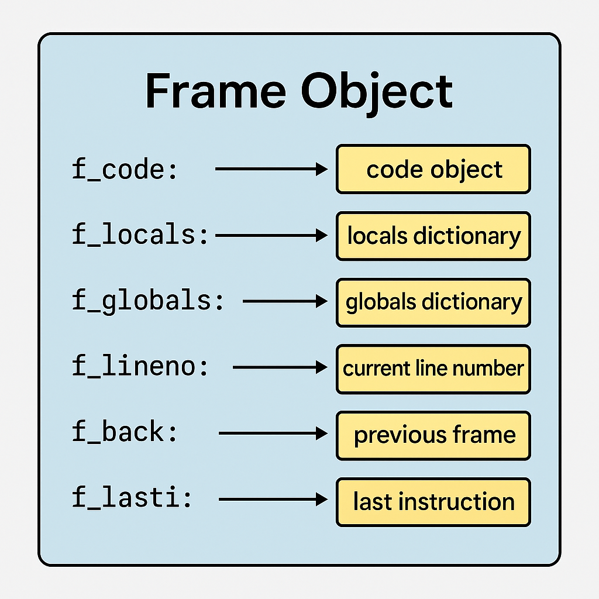
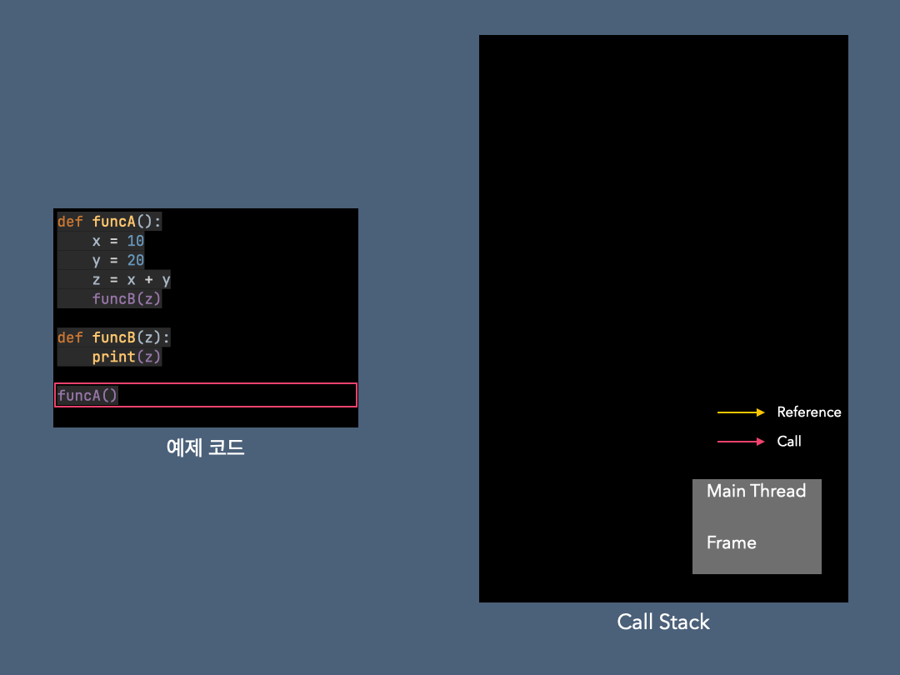
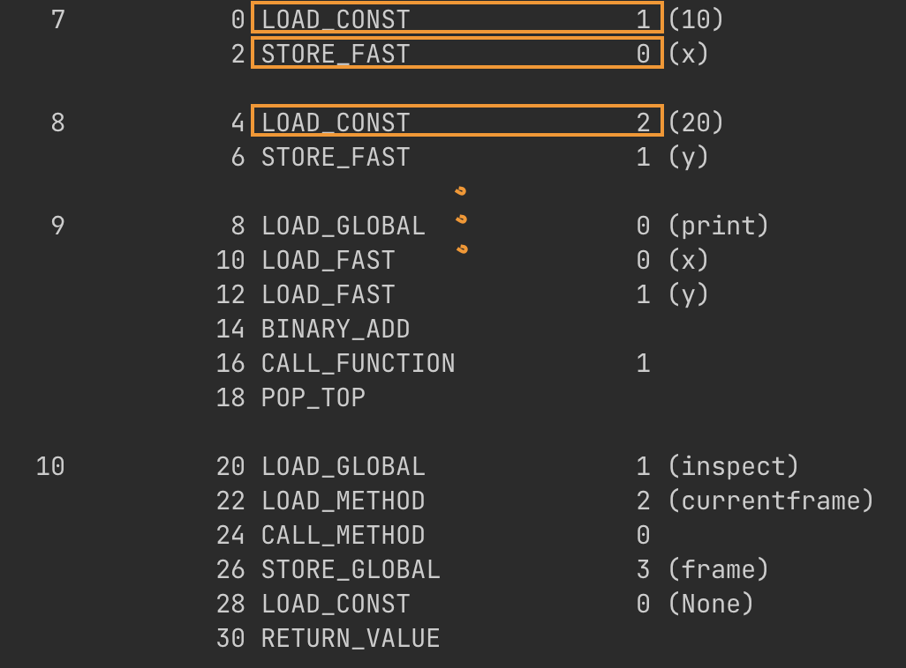

> 목표
> - 코루틴에 동작방식을 이해할 수 있다.
> - 간단한 파이썬 바이트 코드를 다룰 수 있다.
> - `Value Stack`, `Call Stack`, `Frame` 객체에 대해서 얇고 넓게 배운다.


# Coroutine이란 무엇인가?
환경
- python 3.10.14

다음은 간단한 코루틴 예제가 있습니다. 실행 결과는 어떻게 될까요?
```python
# coroutine.py
import asyncio

async def coroutine1():
    print("coroutine1 first entry point")
    await asyncio.sleep(1)
    print("coroutine1 second entry point")

async def coroutine2():
    print("coroutine2 first entry point")
    await asyncio.sleep(2)
    print("coroutine2 second entry point")

loop = asyncio.get_event_loop()
loop.create_task(coroutine1())
loop.create_task(coroutine2())
loop.run_forever()
```
실행결과:
```bash
# coroutine1 first entry point
# coroutine2 first entry point
# coroutine1 second entry point
# coroutine2 second entry point
```
실행결과를 보면 coroutine1과 coroutine2가 섞여서(?) 출력이 되었습니다. 왜 이렇게 동작하는지에 대해서 완벽하게 이해하는게 목표입니다!

## Resuming & Suspending
코루틴을 알기 위해서는 실행(또는 이전 지점 재개)과 일시중지로 작동하는 것을 알아야 합니다.
이전 예제를 다시 살펴봅시다.
```python
# coroutine.py
async def coroutine1():
->  print("coroutine1 first entry point")
<-  await asyncio.sleep(1)
->  print("coroutine1 second entry point")

async def coroutine2():
->  print("coroutine2 first entry point")
<-  await asyncio.sleep(2)
->  print("coroutine2 second entry point")
```
- `->`: Resuming (실행 또는 재개)
- `<-`: Suspending (일시중지)

실행결과를 보면, coroutine1 함수의 첫 번째 print문이 실행되고, 그 다음 라인에 await를 만나 1초동안 일시정지 상태가 됩니다. 마찬가지로 coroutine2 함수의 첫 번째 print문이 실행되고, await를 만나 2초 일시정지 되는 동안 coroutine1의 마지막 print -> coroutine2의 마지막 print가 실행되고 종료되게 됩니다.

그렇다면 여기서 의문이 들 수 있습니다. await를 만나면 일시정지 상태가 되는가? 반은 맞고 반은 틀립니다. await는 일시정지가 될 가능성이 있다는 `힌트`일 뿐입니다. 

# Python Frame Object & Byte Code
후반부에서 다룰 코루틴이 함수를 일시중지하고 재개하는 메커니즘을 이해하기 위해서는 먼저 Frame 객체 그리고 바이트 코드를 알아야 합니다. 먼저 Frame 객체에 대해서 알아보도록 하겠습니다.
  

## Frame Object
  
[Frame](https://docs.python.org/3/reference/datamodel.html#frame-objects) 객체는 함수를 실행하기 위해 필요한 정보들을 담고 있는 객체입니다.  

직접해보는게 이해가 빠르기 때문에 간단한 실습을 통해서 이해해봅시다. inspect 모듈을 import하면 현재 프레임을 얻어올 수 있게 됩니다.
```python
# frame_example.py
import inspect

frame = None

def func():
    global frame
    x = 10
    y = 20
    print(x + y)
    frame = inspect.currentframe()

func()
```
이제 전역 변수 frame에 func 마지막 프레임이 담겼을 것 입니다.

[Frame](https://docs.python.org/3/reference/datamodel.html#frame-objects) 객체에는 여러 메서드들이 있지만 중점적으로 살펴볼 함수들은 다음과 같습니다.
- f_locals
- f_back
- f_lasti
- f_code

</br>

`f_locals`  
```python
print(f"frame.f_locals: {frame.f_locals}")
>> frame.f_locals: {'x': 10, 'y': 20}
```
f_locals는 지역 변수의 상태를 dictionary 형태로 저장하고 있습니다.  

`f_back`
```python
print(f"frame.f_back: {frame.f_back}")
>> frame.f_back: <frame at 0x103045a40, file '/Users/shlee/workspaces/study/iseunghan-Lab/python-deep-dive-into-coroutine/frame_example.py', line 14, code <module>>
```
f_back은 이전 스택 프레임 즉, 이 프레임을 호출한 caller를 가리킵니다. 이 f_back 정보를 들고 있기 때문에 현재 프레임이 종료되면 f_back을 통해 이전 프레임으로 돌아갈 수 있습니다.

[예제 코드](https://github.com/iseunghan/iseunghan-Lab/blob/main/python-deep-dive-into-coroutine/callstack_example.py)에 대한 Call Stack을 좀 더 이해하기 쉽게 짤로 표현해봤습니다.  

새로운 Call (함수 호출)이 발생하면 Frame이 생기게 되고, f_back에는 caller의 정보가 담기게 됩니다. 그 덕분에 함수가 완전히 종료되면 f_back에 있는 정보를 따라 이전 프레임으로 돌아갈 수 있게 됩니다.

`f_lasti`
```python
print(f"frame.f_lasti: {frame.f_lasti}")
>> frame.f_lasti: 30
```
f_lasti의 값이 30이 나왔습니다. 이게 무슨 값인지 알기 위해서는 바이트 코드를 까봐야 합니다. 바이트 코드는 [dis](https://docs.python.org/3/library/dis.html) 모듈을 import해서 `disassemble` 할 수 있습니다.

```python
# byte_code_example.py
import inspect

def func():
    global frame
    x = 10
    y = 20
    print(x + y)
    frame = inspect.currentframe()

func()

print(f"frame.f_lasti: {frame.f_lasti}")

import dis
dis.dis(func)
```

실행결과:
```text
30
frame.f_lasti: 30
6           0 LOAD_CONST               1 (10)
            2 STORE_FAST               0 (x)

7           4 LOAD_CONST               2 (20)
            6 STORE_FAST               1 (y)

8           8 LOAD_GLOBAL              0 (print)
            10 LOAD_FAST                0 (x)
            12 LOAD_FAST                1 (y)
            14 BINARY_ADD
            16 CALL_FUNCTION            1
            18 POP_TOP

9          20 LOAD_GLOBAL              1 (inspect)
            22 LOAD_METHOD              2 (currentframe)
            24 CALL_METHOD              0
            26 STORE_GLOBAL             3 (frame)
            28 LOAD_CONST               0 (None)
            30 RETURN_VALUE
```
lasti는 마지막 라인에 있는 RETURN_VALUE의 30을 가리킵니다. 즉, Frame의 가장 최근에 실행된 바이트 코드의 인덱스(offset)를 의미합니다.

byte 코드를 읽는 방법  

[공식문서](https://docs.python.org/3/library/dis.html#python-bytecode-instructions)에 따르면, 각 컬럼에 대해서는 다음과 같이 정의할 수 있습니다.

| 컬럼 이름                | 설명                                            | 예시 출력                                 |                                              |
| -------------------- | --------------------------------------------- | ------------------------------------- | -------------------------------------------- |
| **starts\_line**     | 해당 바이트코드 명령어가 시작되는 소스 코드의 줄 번호. 새로운 줄에서만 표시됨. | `2`, `None`                           |                                              |
| **offset**           | 바이트코드에서 명령어의 위치를 나타내는 오프셋. 보통 2씩 증가함.         | `0`, `2`, `4` 등                       |                                              |
| **opname**           | 바이트코드 명령어의 이름 (Operation Code Name).          | `LOAD_FAST`, `CALL`, `RETURN_VALUE` 등 |                                              |
| **arg(또는 oparg)**              | 명령어에 전달되는 인자 값. 특정 명령어에서만 표시됨.                | `0`, `1` 등                            |                                              |
| **argval(또는 opargval)**           | 인자의 실제 값. 예: 변수명, 상수 값 등.                     | `'x'`, `'Hello'` 등                    |                                              |
  

`f_code`
```python
print(f"frame.f_code: {frame.f_code}")
>> frame.f_code: <code object func at 0x101bdeb80, file "/Users/shlee/workspaces/study/iseunghan-Lab/python-deep-dive-into-coroutine/frame_example.py", line 3>
```

### code
f_code는 function의 `__code__`와 동일한 객체입니다.
```python
frame.f_code is func.__code__
>> True
```

code 객체에도 여러 가지 함수가 있지만 중점적으로 살펴볼 함수는 다음과 같습니다.
- co_const
- co_names
- co_varnames
- co_code

하나씩 차근차근 살펴보도록 하겠습니다.


`co_code`  
```python
print(func.__code__.co_code)
>> b'd\x01}\x00d\x02}\x01t\x00|\x00|\x01\x17\x00\x83\x01\x01\x00t\x01\xa0\x02\xa1\x00a\x03d\x00S\x00'
```
co_code를 출력해보니 바이트열이 담겨있습니다. 이걸 list로 변환해서 출력해보면?
```python
print(list(func.__code__.co_code))
>> [100, 1, 125, 0, 100, 2, 125, 1, 116, 0, 124, 0, 124, 1, 23, 0, 131, 1, 1, 0, 116, 1, 160, 2, 161, 0, 97, 3, 100, 0, 83, 0]
```
알 수 없는 숫자열이 담겨있습니다. 바로 op_code와 op_arg를 나타냅니다. dis 모듈을 이용해서 func를 바이트 코드로 변환하여 비교해볼까요?


co_code의 숫자값들이 정말 `[op_code, op_arg, ...]`를 나타내는지 확인해보겠습니다.
```python
import opcode

opcode.opname[100]
>> LOAD_CONST

opcode.opname[125]
>> STORE_FAST
```
dis 모듈로 확인한 바이트 코드의 op_name과 동일한 것을 확인할 수 있습니다.   

정리해보자면, co_code는 op_code와 op_arg를 순서대로 나열시킨 바이트열이라고 할 수 있습니다.


`co_consts`
함수 내부에서 사용중인 상수들을 나타냅니다.
```python
print(func.__code__.co_consts)
>> (None, 10, 20)
```
여기서 None은 함수의 기본 반환 값으로 기존 반환 값 여부 상관없이 항상 None 고정입니다.

만일 co_consts에는 함수의 리턴값 또는 매개변수에 대한 정보는 포함되지 않습니다.
```python
# frame_f_code_example.py
print(f"func.co_consts: {func.__code__.co_consts}")
# >> func.co_consts: (None, 10, 20)

def func2(arg2="world") -> str:
    return f"Hello, {arg2}"

print(f"func2.co_consts: {func2.__code__.co_consts}")
# >> func2.co_consts: (None, 'Hello, ')
```

`co_varnames`
```python
# frame_f_code_example.py
func.__code__.co_varnames
# >> ('x', 'y')
```
함수 내의 지역변수명을 튜플 형태로 저장합니다.

`co_names`
```python
func.__code__.co_names
# >> ('print', 'inspect', 'currentframe', 'frame')
```
함수 내의 전역변수명을 튜플의 형태로 저장합니다.
print, inspect 등의 함수들은 built-in 함수라서 전역변수 취급 되었습니다. 


# REFERENCES
- [Deep Dive into Coroutine - 김대희](https://youtu.be/NmSeLspQoAA?feature=shared)
- [Frame objects](https://docs.python.org/3/reference/datamodel.html#frame-objects)