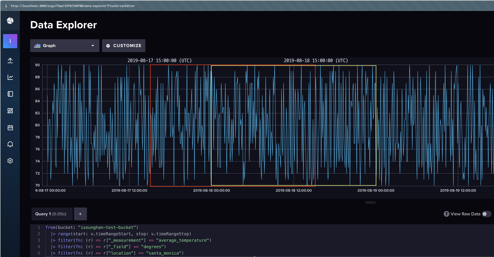

# influxDB aggregateWindow 타임존 이슈 여정기
저번 포스팅에 이어, 이번에는 influxdb의 UTC의 데이터를 `aggregateWindow` 함수를 이용해 집계를 내다보니 KST 기준의 데이터와는 차이가 있어 추후에 실수를 방지하기 위해 삽질했던 경험들을 기록하고 해결한 경험을 소개하고자 합니다.

## 테스트 환경
> 이번 테스트를 위한 influxdb 구축은 따로 설명하지 않습니다.
- python 3.12
- influxdb v2.7.12 (docker)
- test dataset: [noaa-water-sample-data](https://docs.influxdata.com/influxdb/v2/reference/sample-data/#noaa-water-sample-data)
  - time range: `2019-08-17T00:00:00Z` ~ `2019-09-17T22:00:00Z`
  - measurement: [`average_temperature`, `h2o_feet`, `h2o_pH`, `h2o_quality`, `h2o_temperature`]
  - location(tag): [`coyote_creek`, `santa_monica`]
  - field_key: [`degrees`, `index`, `level description`, `pH`, `water_level`]  


##  aggregateWindow는 UTC 기준으로 집계가 이뤄진다
> 관련 코드: main.py/aggregate_with_flux_query_timeSrc 

influxdb에 모든 데이터는 UTC 기준으로 저장되어 있습니다. UTC와 KST는 9시간 차이가 납니다.  
그럼 다음 데이터는 어느 날짜 기준으로 합계되었는지 생각해봅시다.
```shell
from(bucket: "iseunghan-test-bucket")
      |> range(start: 2019-08-17T00:00:00Z, stop: 2019-09-17T22:00:00Z)
      |> filter(fn: (r) => r["_measurement"] == "average_temperature")
      |> filter(fn: (r) => r["location"] == "santa_monica")
      |> filter(fn: (r) => r["_field"] == "degrees")
      |> aggregateWindow(every: 1d, fn: mean, createEmpty: false)
```
예상했던 결과가 다음과 같나요?
```text
                      _time     _value
0 2019-08-17 00:00:00+00:00  80.012500
1 2019-08-18 00:00:00+00:00  80.162500
2 2019-08-19 00:00:00+00:00  79.333333
...
```
  
하지만 실행결과는 어떨까요? _time을 비교해보시면, 날짜가 하루 씩 밀린 것을 확인할 수 있습니다.
```text
                      _time     _value
0 2019-08-18 00:00:00+00:00  80.012500
1 2019-08-19 00:00:00+00:00  80.162500
2 2019-08-20 00:00:00+00:00  79.333333
...
```

이는 `aggregateWindow`의 [timeSrc](https://docs.influxdata.com/flux/v0/stdlib/universe/aggregatewindow/#timesrc) 옵션의 기본값이 `_stop`으로 설정되어 있어서 그렇습니다. 물론 개인마다 기준이 다르겠지만 현재 개발중인 서비스 관점에서는 실시간성으로도 집계가 반영되어야 하기 때문에 8월 17일 00시부터 8월 18일 00시 이전의 데이터의 집계는 8월 17일 날짜로 표기되어야 한다고 생각합니다. 즉, `timeSrc`를 `_start`로 설정하였습니다.
  
다음과 같이 쿼리를 수정하면 원하는 결과를 얻을 수 있습니다.
```shell
from(bucket: "iseunghan-test-bucket")
      |> range(start: 2019-08-17T00:00:00Z, stop: 2019-09-17T22:00:00Z)
      |> filter(fn: (r) => r["_measurement"] == "average_temperature")
      |> filter(fn: (r) => r["location"] == "santa_monica")
      |> filter(fn: (r) => r["_field"] == "degrees")
      |> aggregateWindow(every: 1d, fn: mean, timeSrc: "_start", createEmpty: false)
```
실행 결과:
```text
                      _time     _value
0 2019-08-17 00:00:00+00:00  80.012500
1 2019-08-18 00:00:00+00:00  80.162500
2 2019-08-19 00:00:00+00:00  79.333333
...
```

실제 데이터를 통해서 위 결과가 잘 집계된건지 확인해보겠습니다.
KST 기준으로 집계를 하기 위해 기간은 KST 기준 2019-08-17 자정부터 2019-09-17 22시까지 datetime 객체를 만들고, UTC 시간대로 변환해주었습니다.  이제 해당 시간대의 데이터를 가져온 뒤, pandas를 이용하여 _time을 kst_date로 변환한 뒤, 평균을 내었습니다.
```python
def aggregate_with_pandas():
    start_dt = datetime.datetime(2019, 8, 17, 0, 0, 0, tzinfo=datetime.timezone(timedelta(hours=9))).astimezone(datetime.UTC)
    stop_dt = datetime.datetime(2019, 9, 17, 22, 0, 0, tzinfo=datetime.timezone(timedelta(hours=9))).astimezone(datetime.UTC)

    df = client.query_api().query_data_frame(f'''
        from(bucket: "iseunghan-test-bucket")
          |> range(start: {start_dt.isoformat()}, stop: {stop_dt.isoformat()})
          |> filter(fn: (r) => r["_measurement"] == "average_temperature")
          |> filter(fn: (r) => r["location"] == "santa_monica")
          |> filter(fn: (r) => r["_field"] == "degrees")
        ''')
    
    df = df.drop(columns=["result", "table", "_measurement", "location", "_field", "_start", "_stop"], errors="ignore")
    df["_time_kst"] = pd.to_datetime(df["_time"]).dt.tz_convert("Asia/Seoul")
    df["kst_date"] = df["_time_kst"].dt.date

    # 일자별 합계 집계
    daily_mean = df.groupby("kst_date")["_value"].mean().reset_index()
    print("###### aggregate_with_pandas #######")
    display(daily_mean.head())
    display(".......")
    display(daily_mean.tail())
```
결과는 다음과 같습니다.
```text
###### aggregate_with_pandas #######
     kst_date     _value
0  2019-08-17  79.566667
1  2019-08-18  80.216667
2  2019-08-19  79.841667
3  2019-08-20  79.875000
4  2019-08-21  79.941667
.......
      kst_date     _value
27  2019-09-13  80.058333
28  2019-09-14  80.370833
29  2019-09-15  80.229167
30  2019-09-16  80.508333
31  2019-09-17  80.081818
```
헤더와 테일부분에만 보아도 기존과 값이 다르단 것을 알 수 있습니다. 왜 이런 현상이 발생했을까요?
바로 aggregateWindow는 UTC 기준으로 집계를 내기 때문입니다. 

노란색 영역 UTC 기준으로 조회한 결과, 빨간색 영역은 노란색 영역을 KST 기준으로 `timeshift`를 하여 각각 집계를 낸 것입니다.
서로 다른 시간대 범위의 집계를 내고 있었던 것이었습니다!
- red range: `80.216667`
- yellow range: `80.162500`

### 그럼 range를 UTC timeShift 후 집계하면 되는건가요?
결론적으로는 아닙니다. 역시나 개발자는 왜 아닌지 직접 확인해야 직성에 풀리기 때문에 예제를 통해 살펴봅시다.

먼저 시간을 9시간 KST로 지정하여 조회를 하였습니다. 이렇게 aware-timezone을 이용해 조회를 하면, influxdb가 알아서 UTC로 변환하여 조회하게 됩니다.
```python
def aggregate_with_flux_range_timeshift():
    start_dt = datetime.datetime(2019, 8, 17, 0, 0, 0, tzinfo=datetime.timezone(timedelta(hours=9)))
    stop_dt = datetime.datetime(2019, 9, 17, 22, 0, 0, tzinfo=datetime.timezone(timedelta(hours=9)))

    df = client.query_api().query_data_frame(f'''
        from(bucket: "iseunghan-test-bucket")
          |> range(start: {start_dt.isoformat()}, stop: {stop_dt.isoformat()})
          |> filter(fn: (r) => r["_measurement"] == "average_temperature")
          |> filter(fn: (r) => r["location"] == "santa_monica")
          |> filter(fn: (r) => r["_field"] == "degrees")
          |> aggregateWindow(every: 1d, fn: mean, timeSrc: "_start")
        ''')
    df = df.drop(columns=["result", "table", "_measurement", "location", "_field"], errors="ignore")
    display(df.head())
```
> 이해를 돕고자 `aggregateWindow`의 `createEmpty`를 `true`로 설정하여, 첫 row의 _time이 `2019-08-16 15:00:00+00:00`라는 것을 강조하고 싶었습니다.
  
실행결과를 보면, `_start`와 `_stop`은 KST에서 UTC로 `-9`시간을 timeshift한 범위로 잘 조회했지만, `_time`을 보면 결국은 00시 기준으로 조회가 되고 있습니다. 
```text
                     _start                     _stop                      _time     _value
0 2019-08-16 15:00:00+00:00 2019-09-17 13:00:00+00:00  2019-08-16 15:00:00+00:00        NaN
1 2019-08-16 15:00:00+00:00 2019-09-17 13:00:00+00:00  2019-08-17 00:00:00+00:00  80.012500
2 2019-08-16 15:00:00+00:00 2019-09-17 13:00:00+00:00  2019-08-18 00:00:00+00:00  80.162500
3 2019-08-16 15:00:00+00:00 2019-09-17 13:00:00+00:00  2019-08-19 00:00:00+00:00  79.333333
4 2019-08-16 15:00:00+00:00 2019-09-17 13:00:00+00:00  2019-08-20 00:00:00+00:00  80.137500
...
```
그럼 우리가 원하는 15시 기준으로 집계가 되게하려면 어떻게 해야할까요?  

## LocalTime에 맞게 aggregate를 할 수 있는 방법
클라이언트 LocalTime에 맞게 서버에서 올바른 응답을 줄 수 있도록 하는 방법 두가지를 소개하겠습니다.

### 1) aggregateWindow(?offset: duration)을 활용한 방법
offset 옵션에 대해서 공식문서에서 가져와봤습니다.   
> offset: Duration to shift the window boundaries by. Default is 0s. offset can be negative, indicating that the offset goes backwards in time.

offset은 윈도우의 경계를 지정된 시간만큼 이동시키는데 사용되며, 음수 값을 사용하면 윈도우를 과거로 이동시킬 수 있습니다.
우리의 목표는 UTC 00시가 아닌 전날 15시 기준으로 집계를 내야하며 즉, -9시간을 파라미터로 넘겨주면 되는 것입니다!

그럼 위 그림과 동일하게 window를 KST 00시 기준으로 옮길 수 있는 것이죠!  
아래 실습 코드로 바로 확인해봅시다!  

```python
def aggregate_with_flux_offset():
    df = client.query_api().query_data_frame(f'''
        from(bucket: "iseunghan-test-bucket")
          |> range(start: 2019-08-17T00:00:00+09:00, stop: 2019-09-17T22:00:00+09:00)
          |> filter(fn: (r) => r["_measurement"] == "average_temperature")
          |> filter(fn: (r) => r["location"] == "santa_monica")
          |> filter(fn: (r) => r["_field"] == "degrees")
          |> aggregateWindow(every: 1d, fn: mean, timeSrc: "_start", offset: -9h)
        ''')
    df = df.drop(columns=["result", "table", "_measurement", "location", "_field"], errors="ignore")
    df["_time_kst"] = pd.to_datetime(df["_time"]).dt.tz_convert("Asia/Seoul")
    display(df.head())
```
여기서 range의 `+09:00` 타임존과 `offset: -9h`로 인해 중복으로 -18시간 처리되어 조회되는게 아닌지 궁금해 하실 수 있는데 range는 조회되는 데이터의 범위를 지정해주는 것이고, offset은 집계를 낼 때 window의 위치를 옮기는 것뿐이라 이는 서로 다른 역할을 합니다. (KST 17일 00시는 16일 15시이므로 range를 전날 15시부터 잡는 것입니다!)

실행결과:
```text
                     _start                       _stop                      _time                  _time_kst    _value
0 2019-08-16 15:00:00+00:00   2019-09-17 13:00:00+00:00  2019-08-16 15:00:00+00:00  2019-08-17 00:00:00+09:00 79.566667
1 2019-08-16 15:00:00+00:00   2019-09-17 13:00:00+00:00  2019-08-17 15:00:00+00:00  2019-08-18 00:00:00+09:00 80.216667
2 2019-08-16 15:00:00+00:00   2019-09-17 13:00:00+00:00  2019-08-18 15:00:00+00:00  2019-08-19 00:00:00+09:00 79.841667
3 2019-08-16 15:00:00+00:00   2019-09-17 13:00:00+00:00  2019-08-19 15:00:00+00:00  2019-08-20 00:00:00+09:00 79.875000
4 2019-08-16 15:00:00+00:00   2019-09-17 13:00:00+00:00  2019-08-20 15:00:00+00:00  2019-08-21 00:00:00+09:00 79.941667
... 
```
`_time`과 `_time_kst`를 살펴보시면, 드디어 원하던 KST 기준으로 집계가 정상적으로 이뤄졌습니다..!


# REFERENCES
- [influxdb flux docs](https://docs.influxdata.com/flux/v0/)
- [influxdb aggregatewindow offset](https://docs.influxdata.com/flux/v0/stdlib/universe/aggregatewindow/#offset)
- [influxdb timezone location](https://docs.influxdata.com/flux/v0/stdlib/timezone/location/)